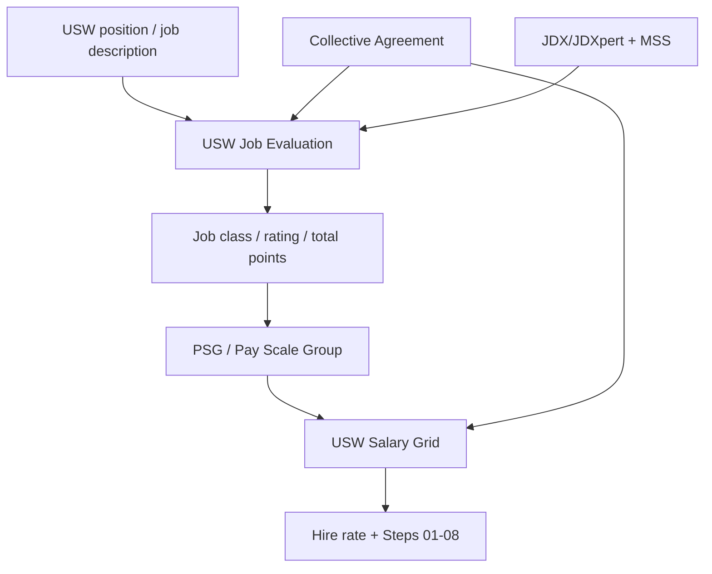

# UofT USW Job Evaluation and Salary Bands

> [!summary]
> Public U of T HR/PSEC documents about USW Pay Scale Groups (PSG), salary grids, job evaluation, reclassification, and the historical creation of job classes/pay bands.

## Main Takeaway
- U of T's public salary-band document for USW is the **USW Salary Grid**, organized by **PSG / Pay Scale Group** and salary steps.
- The public HR site does not appear to publish a complete public mapping of every USW job title to PSG. That relationship is handled through USW Job Evaluation, JDX/JDXpert, MSS/HR processes, and divisional HR.
- Use the job posting or HR record to identify the PSG, then use the salary grid to read the hire rate and steps.

## Document Table
| Document | Type | Saved Source | Extracted chars | Role |
|---|---|---|---:|---|
| [[UofT Agreements/USW Local 1998 Job Evaluation and Salary Bands/Converted Markdown/uoft-salary-ranges-page.md|UofT Salary Ranges Page]] | html | [[UofT Agreements/USW Local 1998 Job Evaluation and Salary Bands/_attachments/Sources/uoft-salary-ranges-page.html|source]] | 16649 | Public index page linking to the USW salary grid. |
| [[UofT Agreements/USW Local 1998 Job Evaluation and Salary Bands/Converted Markdown/usw-2023-2025-salary-grid.md|USW 2023-2025 Salary Grid]] | pdf | [[UofT Agreements/USW Local 1998 Job Evaluation and Salary Bands/_attachments/Sources/usw-2023-2025-salary-grid.pdf|source]] | 5097 | Current public USW salary grid by Pay Scale Group (PSG), hire rate, and steps. |
| [[UofT Agreements/USW Local 1998 Job Evaluation and Salary Bands/Converted Markdown/usw-2021-salary-grid.md|USW 2021 Salary Grid]] | pdf | [[UofT Agreements/USW Local 1998 Job Evaluation and Salary Bands/_attachments/Sources/usw-2021-salary-grid.pdf|source]] | 3262 | Prior USW salary grid useful for historical comparison. |
| [[UofT Agreements/USW Local 1998 Job Evaluation and Salary Bands/Converted Markdown/usw-2020-salary-grid.md|USW 2020 Salary Grid]] | pdf | [[UofT Agreements/USW Local 1998 Job Evaluation and Salary Bands/_attachments/Sources/usw-2020-salary-grid.pdf|source]] | 1646 | Prior USW salary grid useful for historical comparison. |
| [[UofT Agreements/USW Local 1998 Job Evaluation and Salary Bands/Converted Markdown/usw-job-evaluation-year-end-timelines-2025.md|USW Job Evaluation Year-End Timelines 2025]] | html | [[UofT Agreements/USW Local 1998 Job Evaluation and Salary Bands/_attachments/Sources/usw-job-evaluation-year-end-timelines-2025.html|source]] | 11681 | Current memo on USW job evaluation submissions, reclassification, JDX/MSS, and significant change. |
| [[UofT Agreements/USW Local 1998 Job Evaluation and Salary Bands/Converted Markdown/usw-job-evaluation-settlement-2011.md|USW Job Evaluation Settlement 2011]] | html | [[UofT Agreements/USW Local 1998 Job Evaluation and Salary Bands/_attachments/Sources/usw-job-evaluation-settlement-2011.html|source]] | 14109 | Explains creation of the USW job evaluation/classification system and pay bands. |
| [[UofT Agreements/USW Local 1998 Job Evaluation and Salary Bands/Converted Markdown/usw-job-evaluation-2011-implementation.md|USW Job Evaluation 2011 Implementation]] | html | [[UofT Agreements/USW Local 1998 Job Evaluation and Salary Bands/_attachments/Sources/usw-job-evaluation-2011-implementation.html|source]] | 11105 | Explains migration to new salary scales, job class ratings, total points, and pay scale treatment. |
| [[UofT Agreements/USW Local 1998 Job Evaluation and Salary Bands/Converted Markdown/usw-job-evaluation-process-update-2012.md|USW Job Evaluation Process Update 2012]] | html | [[UofT Agreements/USW Local 1998 Job Evaluation and Salary Bands/_attachments/Sources/usw-job-evaluation-process-update-2012.html|source]] | 10069 | Explains movement of rated positions to new job classes and pay bands. |
| [[UofT Agreements/USW Local 1998 Job Evaluation and Salary Bands/Converted Markdown/consistent-job-description-project.md|Consistent Job Description Project]] | html | [[UofT Agreements/USW Local 1998 Job Evaluation and Salary Bands/_attachments/Sources/consistent-job-description-project.html|source]] | 17144 | Explains JDXpert and consistent job descriptions as part of the USW job evaluation process. |
| [[UofT Agreements/USW Local 1998 Job Evaluation and Salary Bands/Converted Markdown/psec-contact-directory-compensation-usw-job-evaluation.md|PSEC Contact Directory - Compensation and USW Job Evaluation]] | html | [[UofT Agreements/USW Local 1998 Job Evaluation and Salary Bands/_attachments/Sources/psec-contact-directory-compensation-usw-job-evaluation.html|source]] | 25444 | Lists Compensation and USW Job Evaluation contact points. |

## Concept Map

## Links
- [[UofT Agreements/USW Local 1998 Job Evaluation and Salary Bands/Converted Markdown/uoft-salary-ranges-page.md|UofT Salary Ranges Page]]
- [[UofT Agreements/USW Local 1998 Job Evaluation and Salary Bands/Converted Markdown/usw-2023-2025-salary-grid.md|USW 2023-2025 Salary Grid]]
- [[UofT Agreements/USW Local 1998 Job Evaluation and Salary Bands/Converted Markdown/usw-2021-salary-grid.md|USW 2021 Salary Grid]]
- [[UofT Agreements/USW Local 1998 Job Evaluation and Salary Bands/Converted Markdown/usw-2020-salary-grid.md|USW 2020 Salary Grid]]
- [[UofT Agreements/USW Local 1998 Job Evaluation and Salary Bands/Converted Markdown/usw-job-evaluation-year-end-timelines-2025.md|USW Job Evaluation Year-End Timelines 2025]]
- [[UofT Agreements/USW Local 1998 Job Evaluation and Salary Bands/Converted Markdown/usw-job-evaluation-settlement-2011.md|USW Job Evaluation Settlement 2011]]
- [[UofT Agreements/USW Local 1998 Job Evaluation and Salary Bands/Converted Markdown/usw-job-evaluation-2011-implementation.md|USW Job Evaluation 2011 Implementation]]
- [[UofT Agreements/USW Local 1998 Job Evaluation and Salary Bands/Converted Markdown/usw-job-evaluation-process-update-2012.md|USW Job Evaluation Process Update 2012]]
- [[UofT Agreements/USW Local 1998 Job Evaluation and Salary Bands/Converted Markdown/consistent-job-description-project.md|Consistent Job Description Project]]
- [[UofT Agreements/USW Local 1998 Job Evaluation and Salary Bands/Converted Markdown/psec-contact-directory-compensation-usw-job-evaluation.md|PSEC Contact Directory - Compensation and USW Job Evaluation]]

## Role Notes
- [[UofT Agreements/USW Local 1998 Job Evaluation and Salary Bands/Role Notes/UofT USW Lab Technician Promotion Paths|UofT USW Lab Technician Promotion Paths]]

## Related Vault Notes
- [[UofT Agreements/USW Local 1998/UofT USW Local 1998 Agreements|USW Local 1998 Collective Agreements]]

## Broader Corpus
- [[UofT Agreements/USW Public HR Corpus/UofT USW Public HR Corpus|UofT USW Public HR Corpus]]

## Session Notes
- [[UofT Agreements/USW Local 1998 Job Evaluation and Salary Bands/Role Notes/UofT USW Research Technician JD Reclassification Session 2026-06-07|UofT USW Research Technician JD Reclassification Session 2026-06-07]]
