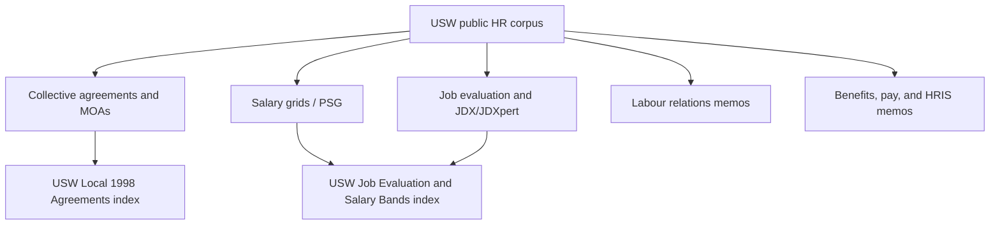

# UofT USW Public HR Corpus

> [!summary]
> Public U of T People Strategy, Equity & Culture documents discovered from searches for USW, United Steelworkers, and Local 1998. Sources were downloaded and converted with MarkItDown for vault search.

## Corpus Summary
- Documents imported: `191`
- `agreement`: 9
- `benefits-pay`: 80
- `job-evaluation`: 19
- `labour-relations`: 75
- `salary-grid`: 8

## Relationship Map

## Documents
| Document | Category | Type | Extracted chars | Source |
|---|---|---|---:|---|
| [[UofT Agreements/USW Public HR Corpus/Converted Markdown/final-usw-college-resident-dons-collective-agreement-2022-2024.pdf-79f3e3f1.md|FINAL-USW-College-Resident-Dons-Collective-Agreement-2022-2024.pdf]] | agreement | pdf | 70420 | [[UofT Agreements/USW Public HR Corpus/_attachments/Sources/final-usw-college-resident-dons-collective-agreement-2022-2024.pdf-79f3e3f1.pdf|source]] |
| [[UofT Agreements/USW Public HR Corpus/Converted Markdown/final_usw-sa-collective-agreement-2023-2026_-fully-signed.pdf-a01b4597.md|FINAL_USW-SA-Collective-Agreement-2023-2026_-Fully-Signed.pdf]] | agreement | pdf | 316393 | [[UofT Agreements/USW Public HR Corpus/_attachments/Sources/final_usw-sa-collective-agreement-2023-2026_-fully-signed.pdf-a01b4597.pdf|source]] |
| [[UofT Agreements/USW Public HR Corpus/Converted Markdown/moa-usw-local-residence-advisors-utsc-25112025.pdf-aacb616f.md|MOA-USW-Local-Residence-Advisors-UTSC-25112025.pdf]] | agreement | pdf | 41243 | [[UofT Agreements/USW Public HR Corpus/_attachments/Sources/moa-usw-local-residence-advisors-utsc-25112025.pdf-aacb616f.pdf|source]] |
| [[UofT Agreements/USW Public HR Corpus/Converted Markdown/moa_usw-1998_residence-dons.pdf-75aa3d3b.md|MOA_USW-1998_Residence-Dons.pdf]] | agreement | pdf | 0 | [[UofT Agreements/USW Public HR Corpus/_attachments/Sources/moa_usw-1998_residence-dons.pdf-75aa3d3b.pdf|source]] |
| [[UofT Agreements/USW Public HR Corpus/Converted Markdown/moa_usw-utm-residence-dons_20240418.pdf-966fac5f.md|MOA_USW-UTM-Residence-Dons_20240418.pdf]] | agreement | pdf | 49482 | [[UofT Agreements/USW Public HR Corpus/_attachments/Sources/moa_usw-utm-residence-dons_20240418.pdf-966fac5f.pdf|source]] |
| [[UofT Agreements/USW Public HR Corpus/Converted Markdown/usw-local-1998--appointed-bb44f8c9.md|USW Local 1998 (Appointed)]] | agreement | html | 25423 | [[UofT Agreements/USW Public HR Corpus/_attachments/Sources/missed-the-memo-bb44f8c9.html|source]] |
| [[UofT Agreements/USW Public HR Corpus/Converted Markdown/usw-casual-collective-agreement-2023-2026_final_fully-signed.pdf-742e2c57.md|USW-Casual-Collective-Agreement-2023-2026_Final_Fully-Signed.pdf]] | agreement | pdf | 129649 | [[UofT Agreements/USW Public HR Corpus/_attachments/Sources/usw-casual-collective-agreement-2023-2026_final_fully-signed.pdf-742e2c57.pdf|source]] |
| [[UofT Agreements/USW Public HR Corpus/Converted Markdown/usw-casual_moa_20240216.pdf-a4da4ce3.md|USW-CASUAL_MOA_20240216.pdf]] | agreement | pdf | 0 | [[UofT Agreements/USW Public HR Corpus/_attachments/Sources/usw-casual_moa_20240216.pdf-a4da4ce3.pdf|source]] |
| [[UofT Agreements/USW Public HR Corpus/Converted Markdown/usw-local-residence-dons-moa-20250326.pdf-eaf52046.md|USW-Local-Residence-Dons-MOA-20250326.pdf]] | agreement | pdf | 142863 | [[UofT Agreements/USW Public HR Corpus/_attachments/Sources/usw-local-residence-dons-moa-20250326.pdf-eaf52046.pdf|source]] |
| [[UofT Agreements/USW Public HR Corpus/Converted Markdown/2008-2009-hr-30--new-voluntary-phased-retirement-program--confidentials-and-usw-a4e0fc1c.md|(2008-2009 HR#30) New Voluntary Phased Retirement Program (Confidentials and USW)]] | benefits-pay | html | 11636 | [[UofT Agreements/USW Public HR Corpus/_attachments/Sources/missed-the-memo-a4e0fc1c.html|source]] |
| [[UofT Agreements/USW Public HR Corpus/Converted Markdown/2009-2010-hr-26--implementation-of-vacation-tracking-on-hris-for-usw-staff-a9dffb95.md|(2009-2010 HR#26) Implementation of Vacation Tracking on HRIS for USW Staff]] | benefits-pay | html | 9822 | [[UofT Agreements/USW Public HR Corpus/_attachments/Sources/missed-the-memo-a9dffb95.html|source]] |
| [[UofT Agreements/USW Public HR Corpus/Converted Markdown/2.-usw-d7106430.md|2. USW]] | benefits-pay | html | 17252 | [[UofT Agreements/USW Public HR Corpus/_attachments/Sources/missed-the-memo-d7106430.html|source]] |
| [[UofT Agreements/USW Public HR Corpus/Converted Markdown/2009-2010-hr7-pandemic-planning-absence-tracking-hris-implementation-5d5cb4dc.md|2009-2010-hr7-pandemic-planning-absence-tracking-hris-implementation]] | benefits-pay | html | 16430 | [[UofT Agreements/USW Public HR Corpus/_attachments/Sources/missed-the-memo-5d5cb4dc.html|source]] |
| [[UofT Agreements/USW Public HR Corpus/Converted Markdown/2012-2013-hr13-update-will-wave-7-implementation-affect-32f02c24.md|2012-2013-hr13-update-will-wave-7-implementation-affect]] | benefits-pay | html | 12752 | [[UofT Agreements/USW Public HR Corpus/_attachments/Sources/missed-the-memo-32f02c24.html|source]] |
| [[UofT Agreements/USW Public HR Corpus/Converted Markdown/2014-12-17-01-timeline-for-january-2015-usw-pm-conf-research-atb-increase.pdf-30e441b1.md|2014-12-17-01-Timeline-for-January-2015-USW-PM-Conf-Research-ATB-Increase.pdf]] | benefits-pay | pdf | 2917 | [[UofT Agreements/USW Public HR Corpus/_attachments/Sources/2014-12-17-01-timeline-for-january-2015-usw-pm-conf-research-atb-increase.pdf-30e441b1.pdf|source]] |
| [[UofT Agreements/USW Public HR Corpus/Converted Markdown/2014-12-17-02-usw-atb-exception-and-update-report.pdf-b676b08d.md|2014-12-17-02-USW-ATB-Exception-and-Update-Report.pdf]] | benefits-pay | pdf | 2798 | [[UofT Agreements/USW Public HR Corpus/_attachments/Sources/2014-12-17-02-usw-atb-exception-and-update-report.pdf-b676b08d.pdf|source]] |
| [[UofT Agreements/USW Public HR Corpus/Converted Markdown/2014-2015-hr5-online-access-university-toronto-pay-statements-31f2f316.md|2014-2015-hr5-online-access-university-toronto-pay-statements]] | benefits-pay | html | 13236 | [[UofT Agreements/USW Public HR Corpus/_attachments/Sources/missed-the-memo-31f2f316.html|source]] |
| [[UofT Agreements/USW Public HR Corpus/Converted Markdown/2017-t4-available-5d48b663.md|2017-t4-available]] | benefits-pay | html | 8863 | [[UofT Agreements/USW Public HR Corpus/_attachments/Sources/missed-the-memo-5d48b663.html|source]] |
| [[UofT Agreements/USW Public HR Corpus/Converted Markdown/2018-tax-slips-available-on-ess-c7c66883.md|2018-tax-slips-available-on-ess]] | benefits-pay | html | 8830 | [[UofT Agreements/USW Public HR Corpus/_attachments/Sources/missed-the-memo-c7c66883.html|source]] |
| [[UofT Agreements/USW Public HR Corpus/Converted Markdown/2022-compensation-update-for-confidential-pm-ap-and-ra-sra-staff-83f0b416.md|2022-compensation-update-for-confidential-pm-ap-and-ra-sra-staff]] | benefits-pay | html | 10199 | [[UofT Agreements/USW Public HR Corpus/_attachments/Sources/missed-the-memo-83f0b416.html|source]] |
| [[UofT Agreements/USW Public HR Corpus/Converted Markdown/3.--usw-staff---atb-increase-697e82d6.md|3.   USW Staff – ATB Increase]] | benefits-pay | html | 12499 | [[UofT Agreements/USW Public HR Corpus/_attachments/Sources/missed-the-memo-697e82d6.html|source]] |
| [[UofT Agreements/USW Public HR Corpus/Converted Markdown/alex-brat-wins-2023-presidents-excellence-award-for-influential-excellence-33fbc531.md|alex-brat-wins-2023-presidents-excellence-award-for-influential-excellence]] | benefits-pay | html | 10427 | [[UofT Agreements/USW Public HR Corpus/_attachments/Sources/missed-the-memo-33fbc531.html|source]] |
| [[UofT Agreements/USW Public HR Corpus/Converted Markdown/an-official-welcome-from-the-university-pension-plan-37b43b38.md|an-official-welcome-from-the-university-pension-plan]] | benefits-pay | html | 12017 | [[UofT Agreements/USW Public HR Corpus/_attachments/Sources/missed-the-memo-37b43b38.html|source]] |
| [[UofT Agreements/USW Public HR Corpus/Converted Markdown/benefit-changes---benefit-plan-premiums-for-the-2015-to-2016-plan-year--united-steel-workers,-local-1998-83a735b1.md|Benefit changes & Benefit plan premiums for the 2015 to 2016 plan year (United Steel Workers, Local 1998)]] | benefits-pay | html | 9845 | [[UofT Agreements/USW Public HR Corpus/_attachments/Sources/missed-the-memo-83a735b1.html|source]] |
| [[UofT Agreements/USW Public HR Corpus/Converted Markdown/central-automation-atb-e1048306.md|central-automation-atb]] | benefits-pay | html | 9793 | [[UofT Agreements/USW Public HR Corpus/_attachments/Sources/missed-the-memo-e1048306.html|source]] |
| [[UofT Agreements/USW Public HR Corpus/Converted Markdown/changes-resulting-from-increase-in-minimum-wage-rates-75a0ec5c.md|changes-resulting-from-increase-in-minimum-wage-rates]] | benefits-pay | html | 9019 | [[UofT Agreements/USW Public HR Corpus/_attachments/Sources/missed-the-memo-75a0ec5c.html|source]] |
| [[UofT Agreements/USW Public HR Corpus/Converted Markdown/compensation-update-for-confidential-pm-ap-and-ra-sra-staff-563406cd.md|compensation-update-for-confidential-pm-ap-and-ra-sra-staff]] | benefits-pay | html | 10251 | [[UofT Agreements/USW Public HR Corpus/_attachments/Sources/missed-the-memo-563406cd.html|source]] |
| [[UofT Agreements/USW Public HR Corpus/Converted Markdown/compensation-update-for-confidential-pm-ap-ra-sra-staff-21c4bfc6.md|compensation-update-for-confidential-pm-ap-ra-sra-staff]] | benefits-pay | html | 9286 | [[UofT Agreements/USW Public HR Corpus/_attachments/Sources/missed-the-memo-21c4bfc6.html|source]] |
| [[UofT Agreements/USW Public HR Corpus/Converted Markdown/covid-19-hris-processing-guide-c2fc7e50.md|covid-19-hris-processing-guide]] | benefits-pay | html | 14096 | [[UofT Agreements/USW Public HR Corpus/_attachments/Sources/missed-the-memo-c2fc7e50.html|source]] |
| [[UofT Agreements/USW Public HR Corpus/Converted Markdown/covid-19-idel-infectious-disease-emergency-leave-processing-guideline-ec5a11b1.md|covid-19-idel-infectious-disease-emergency-leave-processing-guideline]] | benefits-pay | html | 13268 | [[UofT Agreements/USW Public HR Corpus/_attachments/Sources/missed-the-memo-ec5a11b1.html|source]] |
| [[UofT Agreements/USW Public HR Corpus/Converted Markdown/evolution-of-benefits-coverage-for-u-of-ts-trans-and-nonbinary-community-members-42eed42d.md|evolution-of-benefits-coverage-for-u-of-ts-trans-and-nonbinary-community-members]] | benefits-pay | html | 14813 | [[UofT Agreements/USW Public HR Corpus/_attachments/Sources/missed-the-memo-42eed42d.html|source]] |
| [[UofT Agreements/USW Public HR Corpus/Converted Markdown/for-information-and-action--usw-atb-increase-for-october-pay-14ecac92.md|For information and action: USW ATB increase for October pay]] | benefits-pay | html | 10781 | [[UofT Agreements/USW Public HR Corpus/_attachments/Sources/missed-the-memo-14ecac92.html|source]] |
| [[UofT Agreements/USW Public HR Corpus/Converted Markdown/group-seeks-132-volunteers-knitting-crocheting-skill-levels-fd43d563.md|group-seeks-132-volunteers-knitting-crocheting-skill-levels]] | benefits-pay | html | 9028 | [[UofT Agreements/USW Public HR Corpus/_attachments/Sources/missed-the-memo-fd43d563.html|source]] |
| [[UofT Agreements/USW Public HR Corpus/Converted Markdown/january-2015-atb---usw-and-pm,-confidential,-ap,-ra-and-sra-staff-498989f4.md|January 2015 ATB – USW and PM, Confidential, AP, RA and SRA Staff]] | benefits-pay | html | 10957 | [[UofT Agreements/USW Public HR Corpus/_attachments/Sources/missed-the-memo-498989f4.html|source]] |
| [[UofT Agreements/USW Public HR Corpus/Converted Markdown/january-2016-atb---usw-and-pm,-confidential,-ap,-ra-and-sra-staff-bfd98d7d.md|January 2016 ATB – USW and PM, Confidential, AP, RA and SRA Staff]] | benefits-pay | html | 11140 | [[UofT Agreements/USW Public HR Corpus/_attachments/Sources/missed-the-memo-bfd98d7d.html|source]] |
| [[UofT Agreements/USW Public HR Corpus/Converted Markdown/july-2014-atb-increase-for-usw-staff-26c8bbcc.md|July 2014 ATB Increase for USW Staff]] | benefits-pay | html | 9411 | [[UofT Agreements/USW Public HR Corpus/_attachments/Sources/missed-the-memo-26c8bbcc.html|source]] |
| [[UofT Agreements/USW Public HR Corpus/Converted Markdown/july-2015-atb---usw-and-pm,-confidential,-ap,-ra-and-sra-staff-35a3766c.md|July 2015 ATB – USW and PM, Confidential, AP, RA and SRA Staff]] | benefits-pay | html | 11379 | [[UofT Agreements/USW Public HR Corpus/_attachments/Sources/missed-the-memo-35a3766c.html|source]] |
| [[UofT Agreements/USW Public HR Corpus/Converted Markdown/july-2016-atb---academics,-usw,-pm,-confidential,-ap,-ra-and-sra-staff-bb8e6e6f.md|July 2016 ATB – Academics, USW, PM, Confidential, AP, RA and SRA Staff]] | benefits-pay | html | 13484 | [[UofT Agreements/USW Public HR Corpus/_attachments/Sources/missed-the-memo-bb8e6e6f.html|source]] |
| [[UofT Agreements/USW Public HR Corpus/Converted Markdown/july-2024-salary-increases-for-appointed-faculty,-librarians,-usw-and-non-represented-staff-groups---hris-processing-instructions-379c8462.md|July 2024 Salary Increases for Appointed Faculty, Librarians, USW and Non-Represented Staff Groups – HRIS Processing Instructions]] | benefits-pay | html | 17874 | [[UofT Agreements/USW Public HR Corpus/_attachments/Sources/missed-the-memo-379c8462.html|source]] |
| [[UofT Agreements/USW Public HR Corpus/Converted Markdown/july-2025-salary-increases-for-appointed-non-represented-and-usw-staff-groups---hris-processing-instructions-96f233f7.md|July 2025 Salary Increases for Appointed Non-Represented and USW Staff Groups – HRIS Processing Instructions]] | benefits-pay | html | 23670 | [[UofT Agreements/USW Public HR Corpus/_attachments/Sources/missed-the-memo-96f233f7.html|source]] |
| [[UofT Agreements/USW Public HR Corpus/Converted Markdown/july-1-2024-salary-increase-for-unionized-appointed-and-non-appointed-staff-group-in-hris-9af8e394.md|july-1-2024-salary-increase-for-unionized-appointed-and-non-appointed-staff-group-in-hris]] | benefits-pay | html | 12281 | [[UofT Agreements/USW Public HR Corpus/_attachments/Sources/missed-the-memo-9af8e394.html|source]] |
| [[UofT Agreements/USW Public HR Corpus/Converted Markdown/oct-3-upp-update-65c9ce44.md|oct-3-upp-update]] | benefits-pay | html | 11259 | [[UofT Agreements/USW Public HR Corpus/_attachments/Sources/missed-the-memo-65c9ce44.html|source]] |
| [[UofT Agreements/USW Public HR Corpus/Converted Markdown/pension-administration-transition-update-member-questions-and-information-8eea162c.md|pension-administration-transition-update-member-questions-and-information]] | benefits-pay | html | 13516 | [[UofT Agreements/USW Public HR Corpus/_attachments/Sources/missed-the-memo-8eea162c.html|source]] |
| [[UofT Agreements/USW Public HR Corpus/Converted Markdown/pitn-2014-10-29-02-timeline-for-2014-usw-atb-increase-process-1.pdf-c1da4792.md|PITN-2014-10-29-02-Timeline-for-2014-USW-ATB-Increase-Process-1.pdf]] | benefits-pay | pdf | 2857 | [[UofT Agreements/USW Public HR Corpus/_attachments/Sources/pitn-2014-10-29-02-timeline-for-2014-usw-atb-increase-process-1.pdf-c1da4792.pdf|source]] |
| [[UofT Agreements/USW Public HR Corpus/Converted Markdown/pitn-2014-10-29-03-usw-atb-exceptions-and-update-report-1.pdf-aec35c4f.md|PITN-2014-10-29-03-USW-ATB-Exceptions-and-Update-Report-1.pdf]] | benefits-pay | pdf | 2579 | [[UofT Agreements/USW Public HR Corpus/_attachments/Sources/pitn-2014-10-29-03-usw-atb-exceptions-and-update-report-1.pdf-aec35c4f.pdf|source]] |
| [[UofT Agreements/USW Public HR Corpus/Converted Markdown/pitn-2014-10-29-05-atb-increase-process-for-usw-staff-with-segments-after-july-1-1.pdf-143f90c9.md|PITN-2014-10-29-05-ATB-Increase-Process-for-USW-Staff-with-Segments-After-July-1-1.pdf]] | benefits-pay | pdf | 6728 | [[UofT Agreements/USW Public HR Corpus/_attachments/Sources/pitn-2014-10-29-05-atb-increase-process-for-usw-staff-with-segments-after-july-1-1.pdf-143f90c9.pdf|source]] |
| [[UofT Agreements/USW Public HR Corpus/Converted Markdown/pitn-2015-06-26-01-timeline-for-july-usw-pm-conf-1.pdf-4e0f0da8.md|PITN-2015-06-26-01-Timeline-for-July-USW-PM-Conf-1.pdf]] | benefits-pay | pdf | 2943 | [[UofT Agreements/USW Public HR Corpus/_attachments/Sources/pitn-2015-06-26-01-timeline-for-july-usw-pm-conf-1.pdf-4e0f0da8.pdf|source]] |
| [[UofT Agreements/USW Public HR Corpus/Converted Markdown/pitn-2015-06-26-02-usw-atb-exception-and-update-report-1.pdf-57c75694.md|PITN-2015-06-26-02-USW-ATB-Exception-and-Update-Report-1.pdf]] | benefits-pay | pdf | 2773 | [[UofT Agreements/USW Public HR Corpus/_attachments/Sources/pitn-2015-06-26-02-usw-atb-exception-and-update-report-1.pdf-57c75694.pdf|source]] |
| [[UofT Agreements/USW Public HR Corpus/Converted Markdown/pitn-2015-06-26-04-atb-increase-process-for-usw-staff-with-segment-dates-after-july-1-2015-1.pdf-97e285d7.md|PITN-2015-06-26-04-ATB-Increase-Process-for-USW-Staff-with-Segment-Dates-After-July-1-2015-1.pdf]] | benefits-pay | pdf | 6464 | [[UofT Agreements/USW Public HR Corpus/_attachments/Sources/pitn-2015-06-26-04-atb-increase-process-for-usw-staff-with-segment-dates-after-july-1-2015-1.pdf-97e285d7.pdf|source]] |
| [[UofT Agreements/USW Public HR Corpus/Converted Markdown/pitn-2015-12-18-01-timeline-for-january-usw-pm-conf.pdf-46dd3744.md|PITN-2015-12-18-01-Timeline-for-January-USW-PM-Conf.pdf]] | benefits-pay | pdf | 2957 | [[UofT Agreements/USW Public HR Corpus/_attachments/Sources/pitn-2015-12-18-01-timeline-for-january-usw-pm-conf.pdf-46dd3744.pdf|source]] |
| [[UofT Agreements/USW Public HR Corpus/Converted Markdown/pitn-2015-12-18-02-usw-atb-exception-and-update-report.pdf-d847f635.md|PITN-2015-12-18-02-USW-ATB-Exception-and-Update-Report.pdf]] | benefits-pay | pdf | 2785 | [[UofT Agreements/USW Public HR Corpus/_attachments/Sources/pitn-2015-12-18-02-usw-atb-exception-and-update-report.pdf-d847f635.pdf|source]] |
| [[UofT Agreements/USW Public HR Corpus/Converted Markdown/pitn-2015-12-18-04-atb-increase-process-for-usw-staff-with-segment-dates-after-july-1-2015.pdf-9eec6fcc.md|PITN-2015-12-18-04-ATB-Increase-Process-for-USW-Staff-with-Segment-Dates-After-July-1-2015.pdf]] | benefits-pay | pdf | 6685 | [[UofT Agreements/USW Public HR Corpus/_attachments/Sources/pitn-2015-12-18-04-atb-increase-process-for-usw-staff-with-segment-dates-after-july-1-2015.pdf-9eec6fcc.pdf|source]] |
| [[UofT Agreements/USW Public HR Corpus/Converted Markdown/pitn-2016-06-06-usw-atb-exception-and-update-report-july-2016-final.pdf-e4ab05c2.md|PITN-2016-06-06-USW-ATB-Exception-and-Update-Report-July-2016-FINAL.pdf]] | benefits-pay | pdf | 2754 | [[UofT Agreements/USW Public HR Corpus/_attachments/Sources/pitn-2016-06-06-usw-atb-exception-and-update-report-july-2016-final.pdf-e4ab05c2.pdf|source]] |
| [[UofT Agreements/USW Public HR Corpus/Converted Markdown/process-optimization-and-improvements-9e419eed.md|process-optimization-and-improvements]] | benefits-pay | html | 17144 | [[UofT Agreements/USW Public HR Corpus/_attachments/Sources/missed-the-memo-9e419eed.html|source]] |
| [[UofT Agreements/USW Public HR Corpus/Converted Markdown/psec-teams-at-the-fitzgerald-building-f4d175f2.md|psec-teams-at-the-fitzgerald-building]] | benefits-pay | html | 8672 | [[UofT Agreements/USW Public HR Corpus/_attachments/Sources/missed-the-memo-f4d175f2.html|source]] |
| [[UofT Agreements/USW Public HR Corpus/Converted Markdown/retroactive-july-1-atb-increase-process-for-usw-local-1998-appointed-in-hris-df2a24d9.md|Retroactive July 1 ATB Increase Process for USW Local 1998 Appointed in HRIS]] | benefits-pay | html | 11897 | [[UofT Agreements/USW Public HR Corpus/_attachments/Sources/missed-the-memo-df2a24d9.html|source]] |
| [[UofT Agreements/USW Public HR Corpus/Converted Markdown/retroactive-july-1-atb-increase-process-for-usw-local-1998---appointed-staff-in-hris-c2ee08b3.md|Retroactive July 1 ATB Increase Process for USW Local 1998 – Appointed Staff in HRIS]] | benefits-pay | html | 11817 | [[UofT Agreements/USW Public HR Corpus/_attachments/Sources/missed-the-memo-c2ee08b3.html|source]] |
| [[UofT Agreements/USW Public HR Corpus/Converted Markdown/retroactive-july-1-increase-process-for-pm,-confidential,-ra,-sra,-ap-and-usw-in-hris-cc375092.md|Retroactive July 1 Increase Process for PM, Confidential, RA, SRA, AP and USW in HRIS]] | benefits-pay | html | 19320 | [[UofT Agreements/USW Public HR Corpus/_attachments/Sources/missed-the-memo-cc375092.html|source]] |
| [[UofT Agreements/USW Public HR Corpus/Converted Markdown/revolutionizing-hr-f0f12b2c.md|revolutionizing-hr]] | benefits-pay | html | 11221 | [[UofT Agreements/USW Public HR Corpus/_attachments/Sources/missed-the-memo-f0f12b2c.html|source]] |
| [[UofT Agreements/USW Public HR Corpus/Converted Markdown/revolutionizing-hr-2-b9e63dc1.md|revolutionizing-hr-2]] | benefits-pay | html | 11345 | [[UofT Agreements/USW Public HR Corpus/_attachments/Sources/missed-the-memo-b9e63dc1.html|source]] |
| [[UofT Agreements/USW Public HR Corpus/Converted Markdown/salary-ranges-d1d154c8.md|salary-ranges]] | benefits-pay | html | 16649 | [[UofT Agreements/USW Public HR Corpus/_attachments/Sources/missed-the-memo-d1d154c8.html|source]] |
| [[UofT Agreements/USW Public HR Corpus/Converted Markdown/second-annual-awards-of-distinction-b2da261d.md|second-annual-awards-of-distinction]] | benefits-pay | html | 13391 | [[UofT Agreements/USW Public HR Corpus/_attachments/Sources/missed-the-memo-b2da261d.html|source]] |
| [[UofT Agreements/USW Public HR Corpus/Converted Markdown/sept-12-upp-update-a0ab0f4a.md|sept-12-upp-update]] | benefits-pay | html | 10959 | [[UofT Agreements/USW Public HR Corpus/_attachments/Sources/missed-the-memo-a0ab0f4a.html|source]] |
| [[UofT Agreements/USW Public HR Corpus/Converted Markdown/staff-announcement-barb-movrin-d1d0cbb3.md|staff-announcement-barb-movrin]] | benefits-pay | html | 8685 | [[UofT Agreements/USW Public HR Corpus/_attachments/Sources/missed-the-memo-d1d0cbb3.html|source]] |
| [[UofT Agreements/USW Public HR Corpus/Converted Markdown/staff-announcement-jason-lum-director-compensation-a036903f.md|staff-announcement-jason-lum-director-compensation]] | benefits-pay | html | 9690 | [[UofT Agreements/USW Public HR Corpus/_attachments/Sources/missed-the-memo-a036903f.html|source]] |
| [[UofT Agreements/USW Public HR Corpus/Converted Markdown/steelworkers-and-faculty-vote-in-support-of-upp-4e6842a3.md|Steelworkers and Faculty Vote In Support of UPP]] | benefits-pay | html | 11267 | [[UofT Agreements/USW Public HR Corpus/_attachments/Sources/missed-the-memo-4e6842a3.html|source]] |
| [[UofT Agreements/USW Public HR Corpus/Converted Markdown/upcoming-changes-to-hris-personal-leave-recording-for-usw-and-confidential-staff-93ab8e09.md|Upcoming changes to HRIS Personal Leave recording for USW and Confidential staff]] | benefits-pay | html | 9739 | [[UofT Agreements/USW Public HR Corpus/_attachments/Sources/missed-the-memo-93ab8e09.html|source]] |
| [[UofT Agreements/USW Public HR Corpus/Converted Markdown/updated-agreement-upp-d6800c17.md|updated-agreement-upp]] | benefits-pay | html | 9613 | [[UofT Agreements/USW Public HR Corpus/_attachments/Sources/missed-the-memo-d6800c17.html|source]] |
| [[UofT Agreements/USW Public HR Corpus/Converted Markdown/updating-vacation-records-0264ebce.md|updating-vacation-records]] | benefits-pay | html | 9919 | [[UofT Agreements/USW Public HR Corpus/_attachments/Sources/missed-the-memo-0264ebce.html|source]] |
| [[UofT Agreements/USW Public HR Corpus/Converted Markdown/updating-vacation-records-in-hris-for-april-year-end-8fae7d4f.md|updating-vacation-records-in-hris-for-april-year-end]] | benefits-pay | html | 9546 | [[UofT Agreements/USW Public HR Corpus/_attachments/Sources/missed-the-memo-8fae7d4f.html|source]] |
| [[UofT Agreements/USW Public HR Corpus/Converted Markdown/updating-vacation-records-in-hris-prior-to-december-2020-pay-close-a46719e4.md|updating-vacation-records-in-hris-prior-to-december-2020-pay-close]] | benefits-pay | html | 10396 | [[UofT Agreements/USW Public HR Corpus/_attachments/Sources/missed-the-memo-a46719e4.html|source]] |
| [[UofT Agreements/USW Public HR Corpus/Converted Markdown/updating-vacation-records-in-hris-prior-to-december-2021-pay-close-c79948bc.md|updating-vacation-records-in-hris-prior-to-december-2021-pay-close]] | benefits-pay | html | 11303 | [[UofT Agreements/USW Public HR Corpus/_attachments/Sources/missed-the-memo-c79948bc.html|source]] |
| [[UofT Agreements/USW Public HR Corpus/Converted Markdown/updating-vacation-records-in-hris-prior-to-december-pay-close-8b60f1ae.md|updating-vacation-records-in-hris-prior-to-december-pay-close]] | benefits-pay | html | 11235 | [[UofT Agreements/USW Public HR Corpus/_attachments/Sources/missed-the-memo-8b60f1ae.html|source]] |
| [[UofT Agreements/USW Public HR Corpus/Converted Markdown/updating-vacation-records-on-hris-prior-to-april-10-2020-c84e93a6.md|updating-vacation-records-on-hris-prior-to-april-10-2020]] | benefits-pay | html | 11007 | [[UofT Agreements/USW Public HR Corpus/_attachments/Sources/missed-the-memo-c84e93a6.html|source]] |
| [[UofT Agreements/USW Public HR Corpus/Converted Markdown/updating-vacation-records-on-hris-prior-to-april-2019-pay-close-4e82a44b.md|updating-vacation-records-on-hris-prior-to-april-2019-pay-close]] | benefits-pay | html | 10617 | [[UofT Agreements/USW Public HR Corpus/_attachments/Sources/missed-the-memo-4e82a44b.html|source]] |
| [[UofT Agreements/USW Public HR Corpus/Converted Markdown/updating-vacation-records-prior-to-april-pay-close-a0c90dc6.md|updating-vacation-records-prior-to-april-pay-close]] | benefits-pay | html | 10437 | [[UofT Agreements/USW Public HR Corpus/_attachments/Sources/missed-the-memo-a0c90dc6.html|source]] |
| [[UofT Agreements/USW Public HR Corpus/Converted Markdown/upp-consent-achieved-93f2db08.md|upp-consent-achieved]] | benefits-pay | html | 11388 | [[UofT Agreements/USW Public HR Corpus/_attachments/Sources/missed-the-memo-93f2db08.html|source]] |
| [[UofT Agreements/USW Public HR Corpus/Converted Markdown/upp-town-halls-31d4b0a1.md|upp-town-halls]] | benefits-pay | html | 10150 | [[UofT Agreements/USW Public HR Corpus/_attachments/Sources/missed-the-memo-31d4b0a1.html|source]] |
| [[UofT Agreements/USW Public HR Corpus/Converted Markdown/upp-update-2-c521a752.md|upp-update-2]] | benefits-pay | html | 11265 | [[UofT Agreements/USW Public HR Corpus/_attachments/Sources/missed-the-memo-c521a752.html|source]] |
| [[UofT Agreements/USW Public HR Corpus/Converted Markdown/upp-update-info-on-consent-process-79a13950.md|upp-update-info-on-consent-process]] | benefits-pay | html | 11885 | [[UofT Agreements/USW Public HR Corpus/_attachments/Sources/missed-the-memo-79a13950.html|source]] |
| [[UofT Agreements/USW Public HR Corpus/Converted Markdown/upp-update-november-22-50190c0d.md|upp-update-november-22]] | benefits-pay | html | 13856 | [[UofT Agreements/USW Public HR Corpus/_attachments/Sources/missed-the-memo-50190c0d.html|source]] |
| [[UofT Agreements/USW Public HR Corpus/Converted Markdown/usw-local-1998--appointed--benefit-plan-contributions-effective-july-2018-f6fc82b2.md|USW Local 1998 (Appointed): Benefit plan contributions effective July 2018]] | benefits-pay | html | 8906 | [[UofT Agreements/USW Public HR Corpus/_attachments/Sources/missed-the-memo-f6fc82b2.html|source]] |
| [[UofT Agreements/USW Public HR Corpus/Converted Markdown/usw-local-1998--casual----paid-sick-time-and-6--vacation-processing-in-hris-50535dc8.md|USW Local 1998 (Casual) – Paid Sick Time and 6% Vacation Processing in HRIS]] | benefits-pay | html | 9583 | [[UofT Agreements/USW Public HR Corpus/_attachments/Sources/missed-the-memo-50535dc8.html|source]] |
| [[UofT Agreements/USW Public HR Corpus/Converted Markdown/usw-local-1998-special-release-time-pension-meeting---all-campuses-008b21d7.md|USW Local 1998 Special Release-time Pension Meeting – All Campuses]] | benefits-pay | html | 8958 | [[UofT Agreements/USW Public HR Corpus/_attachments/Sources/missed-the-memo-008b21d7.html|source]] |
| [[UofT Agreements/USW Public HR Corpus/Converted Markdown/usw-local-1998-staff-appointed-ratification-meetings-3c498019.md|USW Local 1998—Staff Appointed Ratification Meetings]] | benefits-pay | html | 8134 | [[UofT Agreements/USW Public HR Corpus/_attachments/Sources/missed-the-memo-3c498019.html|source]] |
| [[UofT Agreements/USW Public HR Corpus/Converted Markdown/usw-members-ratify-agreement-with-u-of-t-8f9e67e8.md|USW members ratify agreement with U of T]] | benefits-pay | html | 8530 | [[UofT Agreements/USW Public HR Corpus/_attachments/Sources/missed-the-memo-8f9e67e8.html|source]] |
| [[UofT Agreements/USW Public HR Corpus/Converted Markdown/usw-staff-appointed-ratification-meeting---monday,-february-28,-2022-2231cdef.md|USW Staff-Appointed Ratification Meeting – Monday, February 28, 2022]] | benefits-pay | html | 8602 | [[UofT Agreements/USW Public HR Corpus/_attachments/Sources/missed-the-memo-2231cdef.html|source]] |
| [[UofT Agreements/USW Public HR Corpus/Converted Markdown/usw-staff-appointed-ratification-meeting---tuesday,-march-1,-2022-e5f23882.md|USW Staff-Appointed Ratification Meeting – Tuesday, March 1, 2022]] | benefits-pay | html | 8432 | [[UofT Agreements/USW Public HR Corpus/_attachments/Sources/missed-the-memo-e5f23882.html|source]] |
| [[UofT Agreements/USW Public HR Corpus/Converted Markdown/vacation-records-april-pay-close-482e6529.md|vacation-records-april-pay-close]] | benefits-pay | html | 10767 | [[UofT Agreements/USW Public HR Corpus/_attachments/Sources/missed-the-memo-482e6529.html|source]] |
| [[UofT Agreements/USW Public HR Corpus/Converted Markdown/2010-2011-hr-30,-pdadc-75--usw-job-evaluation-settlement-7aba6e41.md|(2010-2011 HR#30, PDADC#75) USW Job Evaluation Settlement]] | job-evaluation | html | 14109 | [[UofT Agreements/USW Public HR Corpus/_attachments/Sources/missed-the-memo-7aba6e41.html|source]] |
| [[UofT Agreements/USW Public HR Corpus/Converted Markdown/2010-2011-hr-32,-pdadc-78--usw-job-evaluation---next-steps-53602edb.md|(2010-2011 HR#32, PDADC#78) USW Job Evaluation – Next Steps]] | job-evaluation | html | 10129 | [[UofT Agreements/USW Public HR Corpus/_attachments/Sources/missed-the-memo-53602edb.html|source]] |
| [[UofT Agreements/USW Public HR Corpus/Converted Markdown/2011-2012-hr-1--usw-job-evaluation-52ffa118.md|(2011-2012 HR#1) USW Job Evaluation]] | job-evaluation | html | 11105 | [[UofT Agreements/USW Public HR Corpus/_attachments/Sources/missed-the-memo-52ffa118.html|source]] |
| [[UofT Agreements/USW Public HR Corpus/Converted Markdown/2011-2012-hr-3--implementation-of-usw-job-evaluation-system-e0516423.md|(2011-2012 HR#3) Implementation of USW Job Evaluation System]] | job-evaluation | html | 8761 | [[UofT Agreements/USW Public HR Corpus/_attachments/Sources/missed-the-memo-e0516423.html|source]] |
| [[UofT Agreements/USW Public HR Corpus/Converted Markdown/2011-2012-hr-63--usw-job-evaluation-update-a9a3f31c.md|(2011-2012 HR#63) USW Job Evaluation Update]] | job-evaluation | html | 9273 | [[UofT Agreements/USW Public HR Corpus/_attachments/Sources/missed-the-memo-a9a3f31c.html|source]] |
| [[UofT Agreements/USW Public HR Corpus/Converted Markdown/2012-2013-hr-10--job-evaluation-update--implementation-agreement-reached-3d5f4560.md|(2012-2013 HR#10) Job Evaluation Update: Implementation Agreement Reached]] | job-evaluation | html | 8737 | [[UofT Agreements/USW Public HR Corpus/_attachments/Sources/missed-the-memo-3d5f4560.html|source]] |
| [[UofT Agreements/USW Public HR Corpus/Converted Markdown/2012-2013-hr-11--usw-job-evaluation-update---agreement-reached-re-implementation-2748c868.md|(2012-2013 HR#11) USW Job Evaluation Update – Agreement Reached re Implementation]] | job-evaluation | html | 9188 | [[UofT Agreements/USW Public HR Corpus/_attachments/Sources/missed-the-memo-2748c868.html|source]] |
| [[UofT Agreements/USW Public HR Corpus/Converted Markdown/2012-2013-hr-12--details-regarding-the-november-implementation-of-the-new-usw-job-evaluation-system-81f9006d.md|(2012-2013 HR#12) Details regarding the November implementation of the new USW job evaluation system]] | job-evaluation | html | 9029 | [[UofT Agreements/USW Public HR Corpus/_attachments/Sources/missed-the-memo-81f9006d.html|source]] |
| [[UofT Agreements/USW Public HR Corpus/Converted Markdown/2012-2013-hr-5--usw-job-evaluation-process-update---september-28,-2012-97657899.md|(2012-2013 HR#5) USW Job Evaluation Process Update – September 28, 2012]] | job-evaluation | html | 10069 | [[UofT Agreements/USW Public HR Corpus/_attachments/Sources/missed-the-memo-97657899.html|source]] |
| [[UofT Agreements/USW Public HR Corpus/Converted Markdown/2012-2013-hr-6--job-evaluation-process-update--copy-of-message-sent-to-employees-in-the-usw-staff-appointed-unit,-local-1998-c7a4461b.md|(2012-2013 HR#6) Job Evaluation Process Update: Copy of message sent to Employees in the USW Staff-Appointed Unit, Local 1998]] | job-evaluation | html | 8542 | [[UofT Agreements/USW Public HR Corpus/_attachments/Sources/missed-the-memo-c7a4461b.html|source]] |
| [[UofT Agreements/USW Public HR Corpus/Converted Markdown/2006-2007-hr31-sesu-questionnaire-launch-mid-july-4095bb7e.md|2006-2007-hr31-sesu-questionnaire-launch-mid-july]] | job-evaluation | html | 10234 | [[UofT Agreements/USW Public HR Corpus/_attachments/Sources/missed-the-memo-4095bb7e.html|source]] |
| [[UofT Agreements/USW Public HR Corpus/Converted Markdown/2007-2008-hr1-sesu-questionnaire-manager-alert-833ed7ed.md|2007-2008-hr1-sesu-questionnaire-manager-alert]] | job-evaluation | html | 10184 | [[UofT Agreements/USW Public HR Corpus/_attachments/Sources/missed-the-memo-833ed7ed.html|source]] |
| [[UofT Agreements/USW Public HR Corpus/Converted Markdown/jdx-launch-b0d751b8.md|jdx-launch]] | job-evaluation | html | 10494 | [[UofT Agreements/USW Public HR Corpus/_attachments/Sources/missed-the-memo-b0d751b8.html|source]] |
| [[UofT Agreements/USW Public HR Corpus/Converted Markdown/job-evaluation-year-end-timelines-ff0a71f8.md|Job Evaluation Year-End Timelines]] | job-evaluation | html | 11681 | [[UofT Agreements/USW Public HR Corpus/_attachments/Sources/missed-the-memo-ff0a71f8.html|source]] |
| [[UofT Agreements/USW Public HR Corpus/Converted Markdown/modernizing-the-job-evaluation-system-01a0c0d9.md|Modernizing the Job Evaluation System]] | job-evaluation | html | 26995 | [[UofT Agreements/USW Public HR Corpus/_attachments/Sources/missed-the-memo-01a0c0d9.html|source]] |
| [[UofT Agreements/USW Public HR Corpus/Converted Markdown/new-job-evaluation---pay-equity-maintenance-protocol--a-message-from-u-of-t-and-usw-be496be5.md|New Job Evaluation / Pay Equity Maintenance Protocol: A Message from U of T and USW]] | job-evaluation | html | 7662 | [[UofT Agreements/USW Public HR Corpus/_attachments/Sources/missed-the-memo-be496be5.html|source]] |
| [[UofT Agreements/USW Public HR Corpus/Converted Markdown/upcoming-jdx-update-e74a7585.md|upcoming-jdx-update]] | job-evaluation | html | 8167 | [[UofT Agreements/USW Public HR Corpus/_attachments/Sources/missed-the-memo-e74a7585.html|source]] |
| [[UofT Agreements/USW Public HR Corpus/Converted Markdown/usw-job-evaluation-48edd5c4.md|USW Job Evaluation]] | job-evaluation | html | 25444 | [[UofT Agreements/USW Public HR Corpus/_attachments/Sources/missed-the-memo-48edd5c4.html|source]] |
| [[UofT Agreements/USW Public HR Corpus/Converted Markdown/usw-employees-faq.pdf-3cf34e82.md|USW-Employees-FAQ.pdf]] | job-evaluation | pdf | 3076 | [[UofT Agreements/USW Public HR Corpus/_attachments/Sources/usw-employees-faq.pdf-3cf34e82.pdf|source]] |
| [[UofT Agreements/USW Public HR Corpus/Converted Markdown/2006-2007-hr-12--usw-general-membership-meeting-4989fb43.md|(2006-2007 HR#12) USW General Membership Meeting]] | labour-relations | html | 9151 | [[UofT Agreements/USW Public HR Corpus/_attachments/Sources/missed-the-memo-4989fb43.html|source]] |
| [[UofT Agreements/USW Public HR Corpus/Converted Markdown/2006-2007-hr-18--usw-general-membership-meeting-b665a1f9.md|(2006-2007 HR#18) USW General Membership Meeting]] | labour-relations | html | 8969 | [[UofT Agreements/USW Public HR Corpus/_attachments/Sources/missed-the-memo-b665a1f9.html|source]] |
| [[UofT Agreements/USW Public HR Corpus/Converted Markdown/2006-2007-hr-5--usw-general-membership-meeting-e3e43727.md|(2006-2007 HR#5) USW General Membership Meeting]] | labour-relations | html | 9145 | [[UofT Agreements/USW Public HR Corpus/_attachments/Sources/missed-the-memo-e3e43727.html|source]] |
| [[UofT Agreements/USW Public HR Corpus/Converted Markdown/2007-2008-hr-16--usw-general-membership-meeting-f60c6ded.md|(2007-2008 HR#16) USW General Membership Meeting]] | labour-relations | html | 8933 | [[UofT Agreements/USW Public HR Corpus/_attachments/Sources/missed-the-memo-f60c6ded.html|source]] |
| [[UofT Agreements/USW Public HR Corpus/Converted Markdown/2007-2008-hr-4--usw-general-membership-meeting-ee5d4450.md|(2007-2008 HR#4) USW General Membership Meeting]] | labour-relations | html | 8979 | [[UofT Agreements/USW Public HR Corpus/_attachments/Sources/missed-the-memo-ee5d4450.html|source]] |
| [[UofT Agreements/USW Public HR Corpus/Converted Markdown/2007-2008-hr-6--usw-general-membership-meeting-c4795da2.md|(2007-2008 HR#6) USW General Membership Meeting]] | labour-relations | html | 8979 | [[UofT Agreements/USW Public HR Corpus/_attachments/Sources/missed-the-memo-c4795da2.html|source]] |
| [[UofT Agreements/USW Public HR Corpus/Converted Markdown/2008-2009-hr-15--usw-general-membership-meetings-5415ba16.md|(2008-2009 HR#15) USW General Membership Meetings]] | labour-relations | html | 9645 | [[UofT Agreements/USW Public HR Corpus/_attachments/Sources/missed-the-memo-5415ba16.html|source]] |
| [[UofT Agreements/USW Public HR Corpus/Converted Markdown/2009-2010-hr-17--usw-general-membership-meetings-1790bbe1.md|(2009-2010 HR#17) USW General Membership Meetings]] | labour-relations | html | 9392 | [[UofT Agreements/USW Public HR Corpus/_attachments/Sources/missed-the-memo-1790bbe1.html|source]] |
| [[UofT Agreements/USW Public HR Corpus/Converted Markdown/2009-2010-hr-20--dates-for-2010-usw-general-membership-meetings-7de48e0a.md|(2009-2010 HR#20) Dates for 2010 USW General Membership Meetings]] | labour-relations | html | 9498 | [[UofT Agreements/USW Public HR Corpus/_attachments/Sources/missed-the-memo-7de48e0a.html|source]] |
| [[UofT Agreements/USW Public HR Corpus/Converted Markdown/2009-2010-hr-24--usw-general-membership-meeting-on-may-10,-2010-f9366159.md|(2009-2010 HR#24) USW General Membership Meeting on May 10, 2010]] | labour-relations | html | 9122 | [[UofT Agreements/USW Public HR Corpus/_attachments/Sources/missed-the-memo-f9366159.html|source]] |
| [[UofT Agreements/USW Public HR Corpus/Converted Markdown/2009-2010-hr-8--usw-general-membership-meetings-b309f7dc.md|(2009-2010 HR#8) USW General Membership Meetings]] | labour-relations | html | 9643 | [[UofT Agreements/USW Public HR Corpus/_attachments/Sources/missed-the-memo-b309f7dc.html|source]] |
| [[UofT Agreements/USW Public HR Corpus/Converted Markdown/2010-2011-hr-14--usw-general-membership-meeting---december-8,-2010-9298aedc.md|(2010-2011 HR#14) USW General Membership Meeting – December 8, 2010]] | labour-relations | html | 9493 | [[UofT Agreements/USW Public HR Corpus/_attachments/Sources/missed-the-memo-9298aedc.html|source]] |
| [[UofT Agreements/USW Public HR Corpus/Converted Markdown/2010-2011-hr-20--dates-for-2011-usw-general-membership-meetings-ac47b5ef.md|(2010-2011 HR#20) Dates for 2011 USW General Membership Meetings]] | labour-relations | html | 9484 | [[UofT Agreements/USW Public HR Corpus/_attachments/Sources/missed-the-memo-ac47b5ef.html|source]] |
| [[UofT Agreements/USW Public HR Corpus/Converted Markdown/2010-2011-hr-28--usw-general-membership-meeting-at-12-p.m.---may-12,-2011-cdf3cc3d.md|(2010-2011 HR#28) USW General Membership meeting at 12 p.m. – May 12, 2011]] | labour-relations | html | 9710 | [[UofT Agreements/USW Public HR Corpus/_attachments/Sources/missed-the-memo-cdf3cc3d.html|source]] |
| [[UofT Agreements/USW Public HR Corpus/Converted Markdown/2010-2011-hr-4--usw-general-membership-meeting---october-12,-2010-85cfc4ef.md|(2010-2011 HR#4) USW General Membership Meeting – October 12, 2010]] | labour-relations | html | 9718 | [[UofT Agreements/USW Public HR Corpus/_attachments/Sources/missed-the-memo-85cfc4ef.html|source]] |
| [[UofT Agreements/USW Public HR Corpus/Converted Markdown/2011-2012-hr-14--usw-general-membership-meeting---december-8,-2011-041e5b4e.md|(2011-2012 HR#14) USW General Membership Meeting – December 8, 2011]] | labour-relations | html | 9531 | [[UofT Agreements/USW Public HR Corpus/_attachments/Sources/missed-the-memo-041e5b4e.html|source]] |
| [[UofT Agreements/USW Public HR Corpus/Converted Markdown/2011-2012-hr-2--usw-general-membership-meeting---september-7,-2011-2ad10477.md|(2011-2012 HR#2) USW General Membership Meeting – September 7, 2011]] | labour-relations | html | 9784 | [[UofT Agreements/USW Public HR Corpus/_attachments/Sources/missed-the-memo-2ad10477.html|source]] |
| [[UofT Agreements/USW Public HR Corpus/Converted Markdown/2011-2012-hr-4--usw-bargaining-fcc86fe6.md|(2011-2012 HR#4) USW Bargaining]] | labour-relations | html | 8354 | [[UofT Agreements/USW Public HR Corpus/_attachments/Sources/missed-the-memo-fcc86fe6.html|source]] |
| [[UofT Agreements/USW Public HR Corpus/Converted Markdown/2011-2012-hr-40--dates-for-2012-usw-general-membership-meetings-686e787b.md|(2011-2012 HR#40) Dates for 2012 USW General Membership Meetings]] | labour-relations | html | 9572 | [[UofT Agreements/USW Public HR Corpus/_attachments/Sources/missed-the-memo-686e787b.html|source]] |
| [[UofT Agreements/USW Public HR Corpus/Converted Markdown/2011-2012-hr-5--university-of-toronto,-usw-local-1998-agreement-ratified-cd7bcb6b.md|(2011-2012 HR#5) University of Toronto, USW Local 1998 Agreement Ratified]] | labour-relations | html | 8525 | [[UofT Agreements/USW Public HR Corpus/_attachments/Sources/missed-the-memo-cd7bcb6b.html|source]] |
| [[UofT Agreements/USW Public HR Corpus/Converted Markdown/2011-2012-hr-50--reminder-re-usw-general-membership-meeting---april-12,-2012-0025d858.md|(2011-2012 HR#50) Reminder re USW General Membership Meeting – April 12, 2012]] | labour-relations | html | 9813 | [[UofT Agreements/USW Public HR Corpus/_attachments/Sources/missed-the-memo-0025d858.html|source]] |
| [[UofT Agreements/USW Public HR Corpus/Converted Markdown/2012-2013-hr-1--tentative-agreement-reached-between-u-of-t-and-usw-casuals-unit,-local-1998-f2e1e855.md|(2012-2013 HR#1) Tentative agreement reached between U of T and USW Casuals Unit, Local 1998]] | labour-relations | html | 8353 | [[UofT Agreements/USW Public HR Corpus/_attachments/Sources/missed-the-memo-f2e1e855.html|source]] |
| [[UofT Agreements/USW Public HR Corpus/Converted Markdown/2012-2013-hr-2--agreement-ratified-between-u-of-t-and-usw-casuals-unit,-local-1998-5cc7c895.md|(2012-2013 HR#2) Agreement ratified between U of T and USW Casuals Unit, Local 1998]] | labour-relations | html | 8470 | [[UofT Agreements/USW Public HR Corpus/_attachments/Sources/missed-the-memo-5cc7c895.html|source]] |
| [[UofT Agreements/USW Public HR Corpus/Converted Markdown/2012-2013-hr-21--dates-for-2013-usw-general-membership-meetings-b7657be9.md|(2012-2013 HR#21) Dates for 2013 USW General Membership Meetings]] | labour-relations | html | 9879 | [[UofT Agreements/USW Public HR Corpus/_attachments/Sources/missed-the-memo-b7657be9.html|source]] |
| [[UofT Agreements/USW Public HR Corpus/Converted Markdown/2012-2013-hr-3--usw-general-membership-meeting---september-10,-2012-43e1f227.md|(2012-2013 HR#3) USW General Membership Meeting – September 10, 2012]] | labour-relations | html | 9765 | [[UofT Agreements/USW Public HR Corpus/_attachments/Sources/missed-the-memo-43e1f227.html|source]] |
| [[UofT Agreements/USW Public HR Corpus/Converted Markdown/2012-2013-hr-8--usw-general-membership-meeting---december-12,-2012-b1202fe1.md|(2012-2013 HR#8) USW General Membership Meeting – December 12, 2012]] | labour-relations | html | 9487 | [[UofT Agreements/USW Public HR Corpus/_attachments/Sources/missed-the-memo-b1202fe1.html|source]] |
| [[UofT Agreements/USW Public HR Corpus/Converted Markdown/2014-2015-hr-3--tentative-agreement-reached-between-u-of-t-and-united-steelworkers-local-1998-6e577979.md|(2014-2015 HR#3) Tentative agreement reached between U of T and United Steelworkers Local 1998]] | labour-relations | html | 8425 | [[UofT Agreements/USW Public HR Corpus/_attachments/Sources/missed-the-memo-6e577979.html|source]] |
| [[UofT Agreements/USW Public HR Corpus/Converted Markdown/2014-2015-hr-4--university-of-toronto,-united-steelworkers-local-1998---agreement-ratified-8892104f.md|(2014-2015 HR#4) University of Toronto, United Steelworkers Local 1998 – Agreement Ratified]] | labour-relations | html | 9833 | [[UofT Agreements/USW Public HR Corpus/_attachments/Sources/missed-the-memo-8892104f.html|source]] |
| [[UofT Agreements/USW Public HR Corpus/Converted Markdown/2015-2016-hr-15--agreement-ratified-between-university-of-toronto-and-usw,-local-1998--casual-a4c89e58.md|(2015-2016 HR#15) Agreement ratified between University of Toronto and USW, Local 1998 (Casual)]] | labour-relations | html | 8496 | [[UofT Agreements/USW Public HR Corpus/_attachments/Sources/missed-the-memo-a4c89e58.html|source]] |
| [[UofT Agreements/USW Public HR Corpus/Converted Markdown/advance-notice--usw-general-membership-meeting---december-14,-2023-bd73a626.md|Advance Notice: USW General Membership Meeting – December 14, 2023]] | labour-relations | html | 8719 | [[UofT Agreements/USW Public HR Corpus/_attachments/Sources/missed-the-memo-bd73a626.html|source]] |
| [[UofT Agreements/USW Public HR Corpus/Converted Markdown/advance-notice--usw-general-membership-meeting--december-11,-2025-8cf6464e.md|Advance Notice: USW General Membership Meeting: December 11, 2025]] | labour-relations | html | 8644 | [[UofT Agreements/USW Public HR Corpus/_attachments/Sources/missed-the-memo-8cf6464e.html|source]] |
| [[UofT Agreements/USW Public HR Corpus/Converted Markdown/advance-notice--usw-general-membership-meeting--june-10,-2026-e5dbee87.md|Advance Notice: USW General Membership Meeting: June 10, 2026]] | labour-relations | html | 8450 | [[UofT Agreements/USW Public HR Corpus/_attachments/Sources/missed-the-memo-e5dbee87.html|source]] |
| [[UofT Agreements/USW Public HR Corpus/Converted Markdown/advance-notice--usw-general-membership-meeting--june-11,-2025-3143a1f4.md|Advance Notice: USW General Membership Meeting: June 11, 2025]] | labour-relations | html | 8608 | [[UofT Agreements/USW Public HR Corpus/_attachments/Sources/missed-the-memo-3143a1f4.html|source]] |
| [[UofT Agreements/USW Public HR Corpus/Converted Markdown/advance-notice--usw-general-membership-meeting--june-21,-2023-a5dcf9ca.md|Advance Notice: USW General Membership Meeting: June 21, 2023]] | labour-relations | html | 8666 | [[UofT Agreements/USW Public HR Corpus/_attachments/Sources/missed-the-memo-a5dcf9ca.html|source]] |
| [[UofT Agreements/USW Public HR Corpus/Converted Markdown/agreement-ratified-between-university-and-the-united-steelworkers-and-its-local-1998-00eaccfb.md|Agreement ratified between University and The United Steelworkers and its Local 1998]] | labour-relations | html | 8531 | [[UofT Agreements/USW Public HR Corpus/_attachments/Sources/missed-the-memo-00eaccfb.html|source]] |
| [[UofT Agreements/USW Public HR Corpus/Converted Markdown/agreement-ratified-between-university-and-usw-local-1998-casual-unit-2585e481.md|Agreement ratified between University and USW Local 1998 Casual Unit]] | labour-relations | html | 8270 | [[UofT Agreements/USW Public HR Corpus/_attachments/Sources/missed-the-memo-2585e481.html|source]] |
| [[UofT Agreements/USW Public HR Corpus/Converted Markdown/agreement-ratified-between-university-and-usw-local-1998---casual-unit-a978cf47.md|Agreement ratified between University and USW Local 1998 – Casual Unit]] | labour-relations | html | 8321 | [[UofT Agreements/USW Public HR Corpus/_attachments/Sources/missed-the-memo-a978cf47.html|source]] |
| [[UofT Agreements/USW Public HR Corpus/Converted Markdown/agreement-ratified-between-university-and-usw-local-1998---college-residence-dons-7f889664.md|Agreement ratified between University and USW Local 1998 – College Residence Dons]] | labour-relations | html | 8343 | [[UofT Agreements/USW Public HR Corpus/_attachments/Sources/missed-the-memo-7f889664.html|source]] |
| [[UofT Agreements/USW Public HR Corpus/Converted Markdown/agreement-ratified-between-university-and-usw-local-1998---residence-dons-38d2e9db.md|Agreement ratified between University and USW Local 1998 – Residence Dons]] | labour-relations | html | 8217 | [[UofT Agreements/USW Public HR Corpus/_attachments/Sources/missed-the-memo-38d2e9db.html|source]] |
| [[UofT Agreements/USW Public HR Corpus/Converted Markdown/agreement-ratified-between-university-and-usw-local-1998---staff-appointed-unit-3a50082b.md|Agreement ratified between University and USW Local 1998 – Staff Appointed Unit]] | labour-relations | html | 8287 | [[UofT Agreements/USW Public HR Corpus/_attachments/Sources/missed-the-memo-3a50082b.html|source]] |
| [[UofT Agreements/USW Public HR Corpus/Converted Markdown/agreement-ratified-between-university-and-usw-local-1998---utm-residence-dons-0933d8a5.md|Agreement ratified between University and USW Local 1998 – UTM Residence Dons]] | labour-relations | html | 8257 | [[UofT Agreements/USW Public HR Corpus/_attachments/Sources/missed-the-memo-0933d8a5.html|source]] |
| [[UofT Agreements/USW Public HR Corpus/Converted Markdown/agreement-ratified-between-university-and-usw-local-1998-staff-appointed-8571185c.md|Agreement ratified between University and USW Local 1998—Staff-Appointed]] | labour-relations | html | 8285 | [[UofT Agreements/USW Public HR Corpus/_attachments/Sources/missed-the-memo-8571185c.html|source]] |
| [[UofT Agreements/USW Public HR Corpus/Converted Markdown/agreement-ratified-between-university-of-toronto-and-usw-local-1998,-casual-1d03aa0d.md|Agreement ratified between University of Toronto and USW Local 1998, Casual]] | labour-relations | html | 8336 | [[UofT Agreements/USW Public HR Corpus/_attachments/Sources/missed-the-memo-1d03aa0d.html|source]] |
| [[UofT Agreements/USW Public HR Corpus/Converted Markdown/agreement-ratified-between-u-of-t-and-unifor-local-2003-6becc0bc.md|agreement-ratified-between-u-of-t-and-unifor-local-2003]] | labour-relations | html | 8257 | [[UofT Agreements/USW Public HR Corpus/_attachments/Sources/missed-the-memo-6becc0bc.html|source]] |
| [[UofT Agreements/USW Public HR Corpus/Converted Markdown/agreement-ratified-between-university-and-usw-local-1998--utsc-residence-advisors-60bbc634.md|Agreement Ratified between University and USW Local 1998 – UTSC Residence Advisors]] | labour-relations | html | 8333 | [[UofT Agreements/USW Public HR Corpus/_attachments/Sources/missed-the-memo-60bbc634.html|source]] |
| [[UofT Agreements/USW Public HR Corpus/Converted Markdown/bargaining-continues-between-u-of-t-and-usw-6bcd6a8e.md|Bargaining continues between U of T and USW]] | labour-relations | html | 7904 | [[UofT Agreements/USW Public HR Corpus/_attachments/Sources/missed-the-memo-6bcd6a8e.html|source]] |
| [[UofT Agreements/USW Public HR Corpus/Converted Markdown/deadline-extended-for-collective-bargaining-with-usw-28b27eac.md|Deadline Extended for Collective Bargaining with USW]] | labour-relations | html | 8275 | [[UofT Agreements/USW Public HR Corpus/_attachments/Sources/missed-the-memo-28b27eac.html|source]] |
| [[UofT Agreements/USW Public HR Corpus/Converted Markdown/for-information-and-action--agreement-ratified-between-university-of-toronto-and-usw-local-1998,-casual-7fe2a1c3.md|For information and action: Agreement ratified between University of Toronto and USW Local 1998, Casual]] | labour-relations | html | 9786 | [[UofT Agreements/USW Public HR Corpus/_attachments/Sources/missed-the-memo-7fe2a1c3.html|source]] |
| [[UofT Agreements/USW Public HR Corpus/Converted Markdown/rescheduled-date-for-usw-general-membership-meeting---september-20,-2022-4d23dc9b.md|Rescheduled Date for USW General Membership Meeting – September 20, 2022]] | labour-relations | html | 8841 | [[UofT Agreements/USW Public HR Corpus/_attachments/Sources/missed-the-memo-4d23dc9b.html|source]] |
| [[UofT Agreements/USW Public HR Corpus/Converted Markdown/tentative-agreement-reached-between-u-of-t-and-usw-1998-casual-unit-47236bd1.md|Tentative agreement reached between U of T and USW 1998 Casual unit]] | labour-relations | html | 8371 | [[UofT Agreements/USW Public HR Corpus/_attachments/Sources/missed-the-memo-47236bd1.html|source]] |
| [[UofT Agreements/USW Public HR Corpus/Converted Markdown/tentative-agreement-reached-between-university-and-usw-local-1998-8cae30d9.md|Tentative Agreement Reached between University and USW Local 1998]] | labour-relations | html | 8183 | [[UofT Agreements/USW Public HR Corpus/_attachments/Sources/missed-the-memo-8cae30d9.html|source]] |
| [[UofT Agreements/USW Public HR Corpus/Converted Markdown/tentative-agreement-reached-between-university-and-usw-local-1998---utm-residence-dons-bargaining-unit-1e5068e1.md|Tentative Agreement Reached between University and USW Local 1998 – UTM Residence Dons Bargaining Unit]] | labour-relations | html | 8356 | [[UofT Agreements/USW Public HR Corpus/_attachments/Sources/missed-the-memo-1e5068e1.html|source]] |
| [[UofT Agreements/USW Public HR Corpus/Converted Markdown/tentative-agreement-reached-between-university-and-usw-local-1998-casuals-59f819a2.md|Tentative Agreement Reached between University and USW Local 1998—Casuals]] | labour-relations | html | 8179 | [[UofT Agreements/USW Public HR Corpus/_attachments/Sources/missed-the-memo-59f819a2.html|source]] |
| [[UofT Agreements/USW Public HR Corpus/Converted Markdown/tentative-agreement-reached---usw-local-1998---college-residence-dons-unit-0a9ff8bb.md|Tentative Agreement Reached – USW Local 1998 – College Residence Dons Unit]] | labour-relations | html | 8295 | [[UofT Agreements/USW Public HR Corpus/_attachments/Sources/missed-the-memo-0a9ff8bb.html|source]] |
| [[UofT Agreements/USW Public HR Corpus/Converted Markdown/tentative-agreements-reached---usw-local-1998--staff-appointed--and-cupe-3261-full-time---part-time-f1d58c94.md|Tentative Agreements Reached – USW Local 1998 (Staff-Appointed) and CUPE 3261 Full-Time & Part-Time]] | labour-relations | html | 8524 | [[UofT Agreements/USW Public HR Corpus/_attachments/Sources/missed-the-memo-f1d58c94.html|source]] |
| [[UofT Agreements/USW Public HR Corpus/Converted Markdown/tentative-agreement-reached-between-university-and-usw-local-1998--utsc-residence-advisors-bargaining-unit-e09da286.md|Tentative Agreement Reached between University and USW Local 1998 – UTSC Residence Advisors Bargaining Unit]] | labour-relations | html | 8310 | [[UofT Agreements/USW Public HR Corpus/_attachments/Sources/missed-the-memo-e09da286.html|source]] |
| [[UofT Agreements/USW Public HR Corpus/Converted Markdown/tentative-agreement-reached---usw-local-1998,-staff-appointed-unit-188189ba.md|Tentative Agreement Reached – USW Local 1998, Staff-Appointed Unit]] | labour-relations | html | 8251 | [[UofT Agreements/USW Public HR Corpus/_attachments/Sources/missed-the-memo-188189ba.html|source]] |
| [[UofT Agreements/USW Public HR Corpus/Converted Markdown/tentative-agreement-reached--usw-local-1998--residence-dons-units-5a73db6a.md|Tentative Agreement Reached: USW Local 1998 – Residence Dons Units]] | labour-relations | html | 8275 | [[UofT Agreements/USW Public HR Corpus/_attachments/Sources/missed-the-memo-5a73db6a.html|source]] |
| [[UofT Agreements/USW Public HR Corpus/Converted Markdown/tentative-agreement-reached--usw-local-1998--residence-dons-units-8f8bc272.md|Tentative Agreement Reached: USW Local 1998 – Residence Dons Units]] | labour-relations | html | 8557 | [[UofT Agreements/USW Public HR Corpus/_attachments/Sources/missed-the-memo-8f8bc272.html|source]] |
| [[UofT Agreements/USW Public HR Corpus/Converted Markdown/u-of-t-and-usw-reach-tentative-agreement-3349c356.md|U of T and USW reach tentative agreement]] | labour-relations | html | 8985 | [[UofT Agreements/USW Public HR Corpus/_attachments/Sources/missed-the-memo-3349c356.html|source]] |
| [[UofT Agreements/USW Public HR Corpus/Converted Markdown/union-bargaining-at-the-university-of-toronto-update-as-of-february-22-2024-1fb0613d.md|union-bargaining-at-the-university-of-toronto-update-as-of-february-22-2024]] | labour-relations | html | 12623 | [[UofT Agreements/USW Public HR Corpus/_attachments/Sources/missed-the-memo-1fb0613d.html|source]] |
| [[UofT Agreements/USW Public HR Corpus/Converted Markdown/usw-general-membership-meeting-rescheduled-to-october-15,-2015-397973a1.md|USW General Membership Meeting Rescheduled to October 15, 2015]] | labour-relations | html | 7641 | [[UofT Agreements/USW Public HR Corpus/_attachments/Sources/missed-the-memo-397973a1.html|source]] |
| [[UofT Agreements/USW Public HR Corpus/Converted Markdown/usw-general-membership-meeting---august-6,-2020-4669255d.md|USW General Membership Meeting – August 6, 2020]] | labour-relations | html | 8712 | [[UofT Agreements/USW Public HR Corpus/_attachments/Sources/missed-the-memo-4669255d.html|source]] |
| [[UofT Agreements/USW Public HR Corpus/Converted Markdown/usw-general-membership-meeting---december-13,-2018-4a1fb78a.md|USW General Membership Meeting – December 13, 2018]] | labour-relations | html | 8715 | [[UofT Agreements/USW Public HR Corpus/_attachments/Sources/missed-the-memo-4a1fb78a.html|source]] |
| [[UofT Agreements/USW Public HR Corpus/Converted Markdown/usw-general-membership-meeting---december-15,-2022-2996f612.md|USW General Membership Meeting – December 15, 2022]] | labour-relations | html | 8601 | [[UofT Agreements/USW Public HR Corpus/_attachments/Sources/missed-the-memo-2996f612.html|source]] |
| [[UofT Agreements/USW Public HR Corpus/Converted Markdown/usw-general-membership-meeting---june-15,-2022-07f11c5a.md|USW General Membership Meeting – June 15, 2022]] | labour-relations | html | 8524 | [[UofT Agreements/USW Public HR Corpus/_attachments/Sources/missed-the-memo-07f11c5a.html|source]] |
| [[UofT Agreements/USW Public HR Corpus/Converted Markdown/usw-general-membership-meeting---june-18,-2020-7c22b9a4.md|USW General Membership Meeting – June 18, 2020]] | labour-relations | html | 8583 | [[UofT Agreements/USW Public HR Corpus/_attachments/Sources/missed-the-memo-7c22b9a4.html|source]] |
| [[UofT Agreements/USW Public HR Corpus/Converted Markdown/usw-general-membership-meeting---june-21,-2018-29e08424.md|USW General Membership Meeting – June 21, 2018]] | labour-relations | html | 8758 | [[UofT Agreements/USW Public HR Corpus/_attachments/Sources/missed-the-memo-29e08424.html|source]] |
| [[UofT Agreements/USW Public HR Corpus/Converted Markdown/usw-general-membership-meeting---new-time---december-15,-2015-014e6d13.md|USW General Membership Meeting – New Time – December 15, 2015]] | labour-relations | html | 7643 | [[UofT Agreements/USW Public HR Corpus/_attachments/Sources/missed-the-memo-014e6d13.html|source]] |
| [[UofT Agreements/USW Public HR Corpus/Converted Markdown/usw-general-membership-meeting---september-11,-2014-aff46781.md|USW General Membership Meeting – September 11, 2014]] | labour-relations | html | 8959 | [[UofT Agreements/USW Public HR Corpus/_attachments/Sources/missed-the-memo-aff46781.html|source]] |
| [[UofT Agreements/USW Public HR Corpus/Converted Markdown/usw-general-membership-meeting---wednesday,-june-16,-2021-5613982e.md|USW General Membership Meeting – Wednesday, June 16, 2021]] | labour-relations | html | 8540 | [[UofT Agreements/USW Public HR Corpus/_attachments/Sources/missed-the-memo-5613982e.html|source]] |
| [[UofT Agreements/USW Public HR Corpus/Converted Markdown/usw-general-membership-meeting--august-16,-2023-beac0b47.md|USW General Membership Meeting: August 16, 2023]] | labour-relations | html | 8618 | [[UofT Agreements/USW Public HR Corpus/_attachments/Sources/missed-the-memo-beac0b47.html|source]] |
| [[UofT Agreements/USW Public HR Corpus/Converted Markdown/usw-general-membership-meeting--june-12,-2024-f05f2a06.md|USW General Membership Meeting: June 12, 2024]] | labour-relations | html | 8534 | [[UofT Agreements/USW Public HR Corpus/_attachments/Sources/missed-the-memo-f05f2a06.html|source]] |
| [[UofT Agreements/USW Public HR Corpus/Converted Markdown/usw-general-membership-meetings-2015-08355d76.md|USW General Membership Meetings 2015]] | labour-relations | html | 9045 | [[UofT Agreements/USW Public HR Corpus/_attachments/Sources/missed-the-memo-08355d76.html|source]] |
| [[UofT Agreements/USW Public HR Corpus/Converted Markdown/usw-general-membership-meetings-2016-16b681be.md|USW General Membership Meetings 2016]] | labour-relations | html | 8771 | [[UofT Agreements/USW Public HR Corpus/_attachments/Sources/missed-the-memo-16b681be.html|source]] |
| [[UofT Agreements/USW Public HR Corpus/Converted Markdown/2014-12-17-03-usw-exception-descriptions-and-corrective-action-reference-chart-january.pdf-058d1671.md|2014-12-17-03-USW-Exception-Descriptions-and-Corrective-Action-Reference-Chart-January.pdf]] | salary-grid | pdf | 4947 | [[UofT Agreements/USW Public HR Corpus/_attachments/Sources/2014-12-17-03-usw-exception-descriptions-and-corrective-action-reference-chart-january.pdf-058d1671.pdf|source]] |
| [[UofT Agreements/USW Public HR Corpus/Converted Markdown/2014-12-17-04-usw-exception-descriptions-and-corrective-action-reference-chart-january.pdf-8e69c8e1.md|2014-12-17-04-USW-Exception-Descriptions-and-Corrective-Action-Reference-Chart-January.pdf]] | salary-grid | pdf | 4947 | [[UofT Agreements/USW Public HR Corpus/_attachments/Sources/2014-12-17-04-usw-exception-descriptions-and-corrective-action-reference-chart-january.pdf-8e69c8e1.pdf|source]] |
| [[UofT Agreements/USW Public HR Corpus/Converted Markdown/2020-new-usw-salary-grid-university-for-posting-on-website.pdf-fb1427fa.md|2020-New-USW-Salary-Grid-university-for-posting-on-website.pdf]] | salary-grid | pdf | 1646 | [[UofT Agreements/USW Public HR Corpus/_attachments/Sources/2020-new-usw-salary-grid-university-for-posting-on-website.pdf-fb1427fa.pdf|source]] |
| [[UofT Agreements/USW Public HR Corpus/Converted Markdown/2021-new-usw-salary-grid-university.pdf-84554c95.md|2021-New-USW-Salary-Grid-university.pdf]] | salary-grid | pdf | 3262 | [[UofT Agreements/USW Public HR Corpus/_attachments/Sources/2021-new-usw-salary-grid-university.pdf-84554c95.pdf|source]] |
| [[UofT Agreements/USW Public HR Corpus/Converted Markdown/2023-usw-salary-grid-20230912.pdf-7b9e743d.md|2023-USW-Salary-Grid-20230912.pdf]] | salary-grid | pdf | 5097 | [[UofT Agreements/USW Public HR Corpus/_attachments/Sources/2023-usw-salary-grid-20230912.pdf-7b9e743d.pdf|source]] |
| [[UofT Agreements/USW Public HR Corpus/Converted Markdown/hris-operational-improvements--usw-step-placement---progression-report-f6f588c0.md|HRIS Operational Improvements: USW Step Placement / Progression Report]] | salary-grid | html | 10504 | [[UofT Agreements/USW Public HR Corpus/_attachments/Sources/missed-the-memo-f6f588c0.html|source]] |
| [[UofT Agreements/USW Public HR Corpus/Converted Markdown/pitn-2016-06-08-atb-increase-process-for-usw-for-july-1-2016-with-segments-final.pdf-b7a5027a.md|PITN-2016-06-08-ATB-Increase-Process-for-USW-for-July-1-2016-with-Segments-FINAL.pdf]] | salary-grid | pdf | 7097 | [[UofT Agreements/USW Public HR Corpus/_attachments/Sources/pitn-2016-06-08-atb-increase-process-for-usw-for-july-1-2016-with-segments-final.pdf-b7a5027a.pdf|source]] |
| [[UofT Agreements/USW Public HR Corpus/Converted Markdown/usw-moa_20230909.pdf-74a6e4f9.md|USW-MOA_20230909.pdf]] | salary-grid | pdf | 99297 | [[UofT Agreements/USW Public HR Corpus/_attachments/Sources/usw-moa_20230909.pdf-74a6e4f9.pdf|source]] |

## Links
- [[UofT Agreements/USW Public HR Corpus/Converted Markdown/final-usw-college-resident-dons-collective-agreement-2022-2024.pdf-79f3e3f1.md|FINAL-USW-College-Resident-Dons-Collective-Agreement-2022-2024.pdf]]
- [[UofT Agreements/USW Public HR Corpus/Converted Markdown/final_usw-sa-collective-agreement-2023-2026_-fully-signed.pdf-a01b4597.md|FINAL_USW-SA-Collective-Agreement-2023-2026_-Fully-Signed.pdf]]
- [[UofT Agreements/USW Public HR Corpus/Converted Markdown/moa-usw-local-residence-advisors-utsc-25112025.pdf-aacb616f.md|MOA-USW-Local-Residence-Advisors-UTSC-25112025.pdf]]
- [[UofT Agreements/USW Public HR Corpus/Converted Markdown/moa_usw-1998_residence-dons.pdf-75aa3d3b.md|MOA_USW-1998_Residence-Dons.pdf]]
- [[UofT Agreements/USW Public HR Corpus/Converted Markdown/moa_usw-utm-residence-dons_20240418.pdf-966fac5f.md|MOA_USW-UTM-Residence-Dons_20240418.pdf]]
- [[UofT Agreements/USW Public HR Corpus/Converted Markdown/usw-local-1998--appointed-bb44f8c9.md|USW Local 1998 (Appointed)]]
- [[UofT Agreements/USW Public HR Corpus/Converted Markdown/usw-casual-collective-agreement-2023-2026_final_fully-signed.pdf-742e2c57.md|USW-Casual-Collective-Agreement-2023-2026_Final_Fully-Signed.pdf]]
- [[UofT Agreements/USW Public HR Corpus/Converted Markdown/usw-casual_moa_20240216.pdf-a4da4ce3.md|USW-CASUAL_MOA_20240216.pdf]]
- [[UofT Agreements/USW Public HR Corpus/Converted Markdown/usw-local-residence-dons-moa-20250326.pdf-eaf52046.md|USW-Local-Residence-Dons-MOA-20250326.pdf]]
- [[UofT Agreements/USW Public HR Corpus/Converted Markdown/2008-2009-hr-30--new-voluntary-phased-retirement-program--confidentials-and-usw-a4e0fc1c.md|(2008-2009 HR#30) New Voluntary Phased Retirement Program (Confidentials and USW)]]
- [[UofT Agreements/USW Public HR Corpus/Converted Markdown/2009-2010-hr-26--implementation-of-vacation-tracking-on-hris-for-usw-staff-a9dffb95.md|(2009-2010 HR#26) Implementation of Vacation Tracking on HRIS for USW Staff]]
- [[UofT Agreements/USW Public HR Corpus/Converted Markdown/2.-usw-d7106430.md|2. USW]]
- [[UofT Agreements/USW Public HR Corpus/Converted Markdown/2009-2010-hr7-pandemic-planning-absence-tracking-hris-implementation-5d5cb4dc.md|2009-2010-hr7-pandemic-planning-absence-tracking-hris-implementation]]
- [[UofT Agreements/USW Public HR Corpus/Converted Markdown/2012-2013-hr13-update-will-wave-7-implementation-affect-32f02c24.md|2012-2013-hr13-update-will-wave-7-implementation-affect]]
- [[UofT Agreements/USW Public HR Corpus/Converted Markdown/2014-12-17-01-timeline-for-january-2015-usw-pm-conf-research-atb-increase.pdf-30e441b1.md|2014-12-17-01-Timeline-for-January-2015-USW-PM-Conf-Research-ATB-Increase.pdf]]
- [[UofT Agreements/USW Public HR Corpus/Converted Markdown/2014-12-17-02-usw-atb-exception-and-update-report.pdf-b676b08d.md|2014-12-17-02-USW-ATB-Exception-and-Update-Report.pdf]]
- [[UofT Agreements/USW Public HR Corpus/Converted Markdown/2014-2015-hr5-online-access-university-toronto-pay-statements-31f2f316.md|2014-2015-hr5-online-access-university-toronto-pay-statements]]
- [[UofT Agreements/USW Public HR Corpus/Converted Markdown/2017-t4-available-5d48b663.md|2017-t4-available]]
- [[UofT Agreements/USW Public HR Corpus/Converted Markdown/2018-tax-slips-available-on-ess-c7c66883.md|2018-tax-slips-available-on-ess]]
- [[UofT Agreements/USW Public HR Corpus/Converted Markdown/2022-compensation-update-for-confidential-pm-ap-and-ra-sra-staff-83f0b416.md|2022-compensation-update-for-confidential-pm-ap-and-ra-sra-staff]]
- [[UofT Agreements/USW Public HR Corpus/Converted Markdown/3.--usw-staff---atb-increase-697e82d6.md|3.   USW Staff – ATB Increase]]
- [[UofT Agreements/USW Public HR Corpus/Converted Markdown/alex-brat-wins-2023-presidents-excellence-award-for-influential-excellence-33fbc531.md|alex-brat-wins-2023-presidents-excellence-award-for-influential-excellence]]
- [[UofT Agreements/USW Public HR Corpus/Converted Markdown/an-official-welcome-from-the-university-pension-plan-37b43b38.md|an-official-welcome-from-the-university-pension-plan]]
- [[UofT Agreements/USW Public HR Corpus/Converted Markdown/benefit-changes---benefit-plan-premiums-for-the-2015-to-2016-plan-year--united-steel-workers,-local-1998-83a735b1.md|Benefit changes & Benefit plan premiums for the 2015 to 2016 plan year (United Steel Workers, Local 1998)]]
- [[UofT Agreements/USW Public HR Corpus/Converted Markdown/central-automation-atb-e1048306.md|central-automation-atb]]
- [[UofT Agreements/USW Public HR Corpus/Converted Markdown/changes-resulting-from-increase-in-minimum-wage-rates-75a0ec5c.md|changes-resulting-from-increase-in-minimum-wage-rates]]
- [[UofT Agreements/USW Public HR Corpus/Converted Markdown/compensation-update-for-confidential-pm-ap-and-ra-sra-staff-563406cd.md|compensation-update-for-confidential-pm-ap-and-ra-sra-staff]]
- [[UofT Agreements/USW Public HR Corpus/Converted Markdown/compensation-update-for-confidential-pm-ap-ra-sra-staff-21c4bfc6.md|compensation-update-for-confidential-pm-ap-ra-sra-staff]]
- [[UofT Agreements/USW Public HR Corpus/Converted Markdown/covid-19-hris-processing-guide-c2fc7e50.md|covid-19-hris-processing-guide]]
- [[UofT Agreements/USW Public HR Corpus/Converted Markdown/covid-19-idel-infectious-disease-emergency-leave-processing-guideline-ec5a11b1.md|covid-19-idel-infectious-disease-emergency-leave-processing-guideline]]
- [[UofT Agreements/USW Public HR Corpus/Converted Markdown/evolution-of-benefits-coverage-for-u-of-ts-trans-and-nonbinary-community-members-42eed42d.md|evolution-of-benefits-coverage-for-u-of-ts-trans-and-nonbinary-community-members]]
- [[UofT Agreements/USW Public HR Corpus/Converted Markdown/for-information-and-action--usw-atb-increase-for-october-pay-14ecac92.md|For information and action: USW ATB increase for October pay]]
- [[UofT Agreements/USW Public HR Corpus/Converted Markdown/group-seeks-132-volunteers-knitting-crocheting-skill-levels-fd43d563.md|group-seeks-132-volunteers-knitting-crocheting-skill-levels]]
- [[UofT Agreements/USW Public HR Corpus/Converted Markdown/january-2015-atb---usw-and-pm,-confidential,-ap,-ra-and-sra-staff-498989f4.md|January 2015 ATB – USW and PM, Confidential, AP, RA and SRA Staff]]
- [[UofT Agreements/USW Public HR Corpus/Converted Markdown/january-2016-atb---usw-and-pm,-confidential,-ap,-ra-and-sra-staff-bfd98d7d.md|January 2016 ATB – USW and PM, Confidential, AP, RA and SRA Staff]]
- [[UofT Agreements/USW Public HR Corpus/Converted Markdown/july-2014-atb-increase-for-usw-staff-26c8bbcc.md|July 2014 ATB Increase for USW Staff]]
- [[UofT Agreements/USW Public HR Corpus/Converted Markdown/july-2015-atb---usw-and-pm,-confidential,-ap,-ra-and-sra-staff-35a3766c.md|July 2015 ATB – USW and PM, Confidential, AP, RA and SRA Staff]]
- [[UofT Agreements/USW Public HR Corpus/Converted Markdown/july-2016-atb---academics,-usw,-pm,-confidential,-ap,-ra-and-sra-staff-bb8e6e6f.md|July 2016 ATB – Academics, USW, PM, Confidential, AP, RA and SRA Staff]]
- [[UofT Agreements/USW Public HR Corpus/Converted Markdown/july-2024-salary-increases-for-appointed-faculty,-librarians,-usw-and-non-represented-staff-groups---hris-processing-instructions-379c8462.md|July 2024 Salary Increases for Appointed Faculty, Librarians, USW and Non-Represented Staff Groups – HRIS Processing Instructions]]
- [[UofT Agreements/USW Public HR Corpus/Converted Markdown/july-2025-salary-increases-for-appointed-non-represented-and-usw-staff-groups---hris-processing-instructions-96f233f7.md|July 2025 Salary Increases for Appointed Non-Represented and USW Staff Groups – HRIS Processing Instructions]]
- [[UofT Agreements/USW Public HR Corpus/Converted Markdown/july-1-2024-salary-increase-for-unionized-appointed-and-non-appointed-staff-group-in-hris-9af8e394.md|july-1-2024-salary-increase-for-unionized-appointed-and-non-appointed-staff-group-in-hris]]
- [[UofT Agreements/USW Public HR Corpus/Converted Markdown/oct-3-upp-update-65c9ce44.md|oct-3-upp-update]]
- [[UofT Agreements/USW Public HR Corpus/Converted Markdown/pension-administration-transition-update-member-questions-and-information-8eea162c.md|pension-administration-transition-update-member-questions-and-information]]
- [[UofT Agreements/USW Public HR Corpus/Converted Markdown/pitn-2014-10-29-02-timeline-for-2014-usw-atb-increase-process-1.pdf-c1da4792.md|PITN-2014-10-29-02-Timeline-for-2014-USW-ATB-Increase-Process-1.pdf]]
- [[UofT Agreements/USW Public HR Corpus/Converted Markdown/pitn-2014-10-29-03-usw-atb-exceptions-and-update-report-1.pdf-aec35c4f.md|PITN-2014-10-29-03-USW-ATB-Exceptions-and-Update-Report-1.pdf]]
- [[UofT Agreements/USW Public HR Corpus/Converted Markdown/pitn-2014-10-29-05-atb-increase-process-for-usw-staff-with-segments-after-july-1-1.pdf-143f90c9.md|PITN-2014-10-29-05-ATB-Increase-Process-for-USW-Staff-with-Segments-After-July-1-1.pdf]]
- [[UofT Agreements/USW Public HR Corpus/Converted Markdown/pitn-2015-06-26-01-timeline-for-july-usw-pm-conf-1.pdf-4e0f0da8.md|PITN-2015-06-26-01-Timeline-for-July-USW-PM-Conf-1.pdf]]
- [[UofT Agreements/USW Public HR Corpus/Converted Markdown/pitn-2015-06-26-02-usw-atb-exception-and-update-report-1.pdf-57c75694.md|PITN-2015-06-26-02-USW-ATB-Exception-and-Update-Report-1.pdf]]
- [[UofT Agreements/USW Public HR Corpus/Converted Markdown/pitn-2015-06-26-04-atb-increase-process-for-usw-staff-with-segment-dates-after-july-1-2015-1.pdf-97e285d7.md|PITN-2015-06-26-04-ATB-Increase-Process-for-USW-Staff-with-Segment-Dates-After-July-1-2015-1.pdf]]
- [[UofT Agreements/USW Public HR Corpus/Converted Markdown/pitn-2015-12-18-01-timeline-for-january-usw-pm-conf.pdf-46dd3744.md|PITN-2015-12-18-01-Timeline-for-January-USW-PM-Conf.pdf]]
- [[UofT Agreements/USW Public HR Corpus/Converted Markdown/pitn-2015-12-18-02-usw-atb-exception-and-update-report.pdf-d847f635.md|PITN-2015-12-18-02-USW-ATB-Exception-and-Update-Report.pdf]]
- [[UofT Agreements/USW Public HR Corpus/Converted Markdown/pitn-2015-12-18-04-atb-increase-process-for-usw-staff-with-segment-dates-after-july-1-2015.pdf-9eec6fcc.md|PITN-2015-12-18-04-ATB-Increase-Process-for-USW-Staff-with-Segment-Dates-After-July-1-2015.pdf]]
- [[UofT Agreements/USW Public HR Corpus/Converted Markdown/pitn-2016-06-06-usw-atb-exception-and-update-report-july-2016-final.pdf-e4ab05c2.md|PITN-2016-06-06-USW-ATB-Exception-and-Update-Report-July-2016-FINAL.pdf]]
- [[UofT Agreements/USW Public HR Corpus/Converted Markdown/process-optimization-and-improvements-9e419eed.md|process-optimization-and-improvements]]
- [[UofT Agreements/USW Public HR Corpus/Converted Markdown/psec-teams-at-the-fitzgerald-building-f4d175f2.md|psec-teams-at-the-fitzgerald-building]]
- [[UofT Agreements/USW Public HR Corpus/Converted Markdown/retroactive-july-1-atb-increase-process-for-usw-local-1998-appointed-in-hris-df2a24d9.md|Retroactive July 1 ATB Increase Process for USW Local 1998 Appointed in HRIS]]
- [[UofT Agreements/USW Public HR Corpus/Converted Markdown/retroactive-july-1-atb-increase-process-for-usw-local-1998---appointed-staff-in-hris-c2ee08b3.md|Retroactive July 1 ATB Increase Process for USW Local 1998 – Appointed Staff in HRIS]]
- [[UofT Agreements/USW Public HR Corpus/Converted Markdown/retroactive-july-1-increase-process-for-pm,-confidential,-ra,-sra,-ap-and-usw-in-hris-cc375092.md|Retroactive July 1 Increase Process for PM, Confidential, RA, SRA, AP and USW in HRIS]]
- [[UofT Agreements/USW Public HR Corpus/Converted Markdown/revolutionizing-hr-f0f12b2c.md|revolutionizing-hr]]
- [[UofT Agreements/USW Public HR Corpus/Converted Markdown/revolutionizing-hr-2-b9e63dc1.md|revolutionizing-hr-2]]
- [[UofT Agreements/USW Public HR Corpus/Converted Markdown/salary-ranges-d1d154c8.md|salary-ranges]]
- [[UofT Agreements/USW Public HR Corpus/Converted Markdown/second-annual-awards-of-distinction-b2da261d.md|second-annual-awards-of-distinction]]
- [[UofT Agreements/USW Public HR Corpus/Converted Markdown/sept-12-upp-update-a0ab0f4a.md|sept-12-upp-update]]
- [[UofT Agreements/USW Public HR Corpus/Converted Markdown/staff-announcement-barb-movrin-d1d0cbb3.md|staff-announcement-barb-movrin]]
- [[UofT Agreements/USW Public HR Corpus/Converted Markdown/staff-announcement-jason-lum-director-compensation-a036903f.md|staff-announcement-jason-lum-director-compensation]]
- [[UofT Agreements/USW Public HR Corpus/Converted Markdown/steelworkers-and-faculty-vote-in-support-of-upp-4e6842a3.md|Steelworkers and Faculty Vote In Support of UPP]]
- [[UofT Agreements/USW Public HR Corpus/Converted Markdown/upcoming-changes-to-hris-personal-leave-recording-for-usw-and-confidential-staff-93ab8e09.md|Upcoming changes to HRIS Personal Leave recording for USW and Confidential staff]]
- [[UofT Agreements/USW Public HR Corpus/Converted Markdown/updated-agreement-upp-d6800c17.md|updated-agreement-upp]]
- [[UofT Agreements/USW Public HR Corpus/Converted Markdown/updating-vacation-records-0264ebce.md|updating-vacation-records]]
- [[UofT Agreements/USW Public HR Corpus/Converted Markdown/updating-vacation-records-in-hris-for-april-year-end-8fae7d4f.md|updating-vacation-records-in-hris-for-april-year-end]]
- [[UofT Agreements/USW Public HR Corpus/Converted Markdown/updating-vacation-records-in-hris-prior-to-december-2020-pay-close-a46719e4.md|updating-vacation-records-in-hris-prior-to-december-2020-pay-close]]
- [[UofT Agreements/USW Public HR Corpus/Converted Markdown/updating-vacation-records-in-hris-prior-to-december-2021-pay-close-c79948bc.md|updating-vacation-records-in-hris-prior-to-december-2021-pay-close]]
- [[UofT Agreements/USW Public HR Corpus/Converted Markdown/updating-vacation-records-in-hris-prior-to-december-pay-close-8b60f1ae.md|updating-vacation-records-in-hris-prior-to-december-pay-close]]
- [[UofT Agreements/USW Public HR Corpus/Converted Markdown/updating-vacation-records-on-hris-prior-to-april-10-2020-c84e93a6.md|updating-vacation-records-on-hris-prior-to-april-10-2020]]
- [[UofT Agreements/USW Public HR Corpus/Converted Markdown/updating-vacation-records-on-hris-prior-to-april-2019-pay-close-4e82a44b.md|updating-vacation-records-on-hris-prior-to-april-2019-pay-close]]
- [[UofT Agreements/USW Public HR Corpus/Converted Markdown/updating-vacation-records-prior-to-april-pay-close-a0c90dc6.md|updating-vacation-records-prior-to-april-pay-close]]
- [[UofT Agreements/USW Public HR Corpus/Converted Markdown/upp-consent-achieved-93f2db08.md|upp-consent-achieved]]
- [[UofT Agreements/USW Public HR Corpus/Converted Markdown/upp-town-halls-31d4b0a1.md|upp-town-halls]]
- [[UofT Agreements/USW Public HR Corpus/Converted Markdown/upp-update-2-c521a752.md|upp-update-2]]
- [[UofT Agreements/USW Public HR Corpus/Converted Markdown/upp-update-info-on-consent-process-79a13950.md|upp-update-info-on-consent-process]]
- [[UofT Agreements/USW Public HR Corpus/Converted Markdown/upp-update-november-22-50190c0d.md|upp-update-november-22]]
- [[UofT Agreements/USW Public HR Corpus/Converted Markdown/usw-local-1998--appointed--benefit-plan-contributions-effective-july-2018-f6fc82b2.md|USW Local 1998 (Appointed): Benefit plan contributions effective July 2018]]
- [[UofT Agreements/USW Public HR Corpus/Converted Markdown/usw-local-1998--casual----paid-sick-time-and-6--vacation-processing-in-hris-50535dc8.md|USW Local 1998 (Casual) – Paid Sick Time and 6% Vacation Processing in HRIS]]
- [[UofT Agreements/USW Public HR Corpus/Converted Markdown/usw-local-1998-special-release-time-pension-meeting---all-campuses-008b21d7.md|USW Local 1998 Special Release-time Pension Meeting – All Campuses]]
- [[UofT Agreements/USW Public HR Corpus/Converted Markdown/usw-local-1998-staff-appointed-ratification-meetings-3c498019.md|USW Local 1998—Staff Appointed Ratification Meetings]]
- [[UofT Agreements/USW Public HR Corpus/Converted Markdown/usw-members-ratify-agreement-with-u-of-t-8f9e67e8.md|USW members ratify agreement with U of T]]
- [[UofT Agreements/USW Public HR Corpus/Converted Markdown/usw-staff-appointed-ratification-meeting---monday,-february-28,-2022-2231cdef.md|USW Staff-Appointed Ratification Meeting – Monday, February 28, 2022]]
- [[UofT Agreements/USW Public HR Corpus/Converted Markdown/usw-staff-appointed-ratification-meeting---tuesday,-march-1,-2022-e5f23882.md|USW Staff-Appointed Ratification Meeting – Tuesday, March 1, 2022]]
- [[UofT Agreements/USW Public HR Corpus/Converted Markdown/vacation-records-april-pay-close-482e6529.md|vacation-records-april-pay-close]]
- [[UofT Agreements/USW Public HR Corpus/Converted Markdown/2010-2011-hr-30,-pdadc-75--usw-job-evaluation-settlement-7aba6e41.md|(2010-2011 HR#30, PDADC#75) USW Job Evaluation Settlement]]
- [[UofT Agreements/USW Public HR Corpus/Converted Markdown/2010-2011-hr-32,-pdadc-78--usw-job-evaluation---next-steps-53602edb.md|(2010-2011 HR#32, PDADC#78) USW Job Evaluation – Next Steps]]
- [[UofT Agreements/USW Public HR Corpus/Converted Markdown/2011-2012-hr-1--usw-job-evaluation-52ffa118.md|(2011-2012 HR#1) USW Job Evaluation]]
- [[UofT Agreements/USW Public HR Corpus/Converted Markdown/2011-2012-hr-3--implementation-of-usw-job-evaluation-system-e0516423.md|(2011-2012 HR#3) Implementation of USW Job Evaluation System]]
- [[UofT Agreements/USW Public HR Corpus/Converted Markdown/2011-2012-hr-63--usw-job-evaluation-update-a9a3f31c.md|(2011-2012 HR#63) USW Job Evaluation Update]]
- [[UofT Agreements/USW Public HR Corpus/Converted Markdown/2012-2013-hr-10--job-evaluation-update--implementation-agreement-reached-3d5f4560.md|(2012-2013 HR#10) Job Evaluation Update: Implementation Agreement Reached]]
- [[UofT Agreements/USW Public HR Corpus/Converted Markdown/2012-2013-hr-11--usw-job-evaluation-update---agreement-reached-re-implementation-2748c868.md|(2012-2013 HR#11) USW Job Evaluation Update – Agreement Reached re Implementation]]
- [[UofT Agreements/USW Public HR Corpus/Converted Markdown/2012-2013-hr-12--details-regarding-the-november-implementation-of-the-new-usw-job-evaluation-system-81f9006d.md|(2012-2013 HR#12) Details regarding the November implementation of the new USW job evaluation system]]
- [[UofT Agreements/USW Public HR Corpus/Converted Markdown/2012-2013-hr-5--usw-job-evaluation-process-update---september-28,-2012-97657899.md|(2012-2013 HR#5) USW Job Evaluation Process Update – September 28, 2012]]
- [[UofT Agreements/USW Public HR Corpus/Converted Markdown/2012-2013-hr-6--job-evaluation-process-update--copy-of-message-sent-to-employees-in-the-usw-staff-appointed-unit,-local-1998-c7a4461b.md|(2012-2013 HR#6) Job Evaluation Process Update: Copy of message sent to Employees in the USW Staff-Appointed Unit, Local 1998]]
- [[UofT Agreements/USW Public HR Corpus/Converted Markdown/2006-2007-hr31-sesu-questionnaire-launch-mid-july-4095bb7e.md|2006-2007-hr31-sesu-questionnaire-launch-mid-july]]
- [[UofT Agreements/USW Public HR Corpus/Converted Markdown/2007-2008-hr1-sesu-questionnaire-manager-alert-833ed7ed.md|2007-2008-hr1-sesu-questionnaire-manager-alert]]
- [[UofT Agreements/USW Public HR Corpus/Converted Markdown/jdx-launch-b0d751b8.md|jdx-launch]]
- [[UofT Agreements/USW Public HR Corpus/Converted Markdown/job-evaluation-year-end-timelines-ff0a71f8.md|Job Evaluation Year-End Timelines]]
- [[UofT Agreements/USW Public HR Corpus/Converted Markdown/modernizing-the-job-evaluation-system-01a0c0d9.md|Modernizing the Job Evaluation System]]
- [[UofT Agreements/USW Public HR Corpus/Converted Markdown/new-job-evaluation---pay-equity-maintenance-protocol--a-message-from-u-of-t-and-usw-be496be5.md|New Job Evaluation / Pay Equity Maintenance Protocol: A Message from U of T and USW]]
- [[UofT Agreements/USW Public HR Corpus/Converted Markdown/upcoming-jdx-update-e74a7585.md|upcoming-jdx-update]]
- [[UofT Agreements/USW Public HR Corpus/Converted Markdown/usw-job-evaluation-48edd5c4.md|USW Job Evaluation]]
- [[UofT Agreements/USW Public HR Corpus/Converted Markdown/usw-employees-faq.pdf-3cf34e82.md|USW-Employees-FAQ.pdf]]
- [[UofT Agreements/USW Public HR Corpus/Converted Markdown/2006-2007-hr-12--usw-general-membership-meeting-4989fb43.md|(2006-2007 HR#12) USW General Membership Meeting]]
- [[UofT Agreements/USW Public HR Corpus/Converted Markdown/2006-2007-hr-18--usw-general-membership-meeting-b665a1f9.md|(2006-2007 HR#18) USW General Membership Meeting]]
- [[UofT Agreements/USW Public HR Corpus/Converted Markdown/2006-2007-hr-5--usw-general-membership-meeting-e3e43727.md|(2006-2007 HR#5) USW General Membership Meeting]]
- [[UofT Agreements/USW Public HR Corpus/Converted Markdown/2007-2008-hr-16--usw-general-membership-meeting-f60c6ded.md|(2007-2008 HR#16) USW General Membership Meeting]]
- [[UofT Agreements/USW Public HR Corpus/Converted Markdown/2007-2008-hr-4--usw-general-membership-meeting-ee5d4450.md|(2007-2008 HR#4) USW General Membership Meeting]]
- [[UofT Agreements/USW Public HR Corpus/Converted Markdown/2007-2008-hr-6--usw-general-membership-meeting-c4795da2.md|(2007-2008 HR#6) USW General Membership Meeting]]
- [[UofT Agreements/USW Public HR Corpus/Converted Markdown/2008-2009-hr-15--usw-general-membership-meetings-5415ba16.md|(2008-2009 HR#15) USW General Membership Meetings]]
- [[UofT Agreements/USW Public HR Corpus/Converted Markdown/2009-2010-hr-17--usw-general-membership-meetings-1790bbe1.md|(2009-2010 HR#17) USW General Membership Meetings]]
- [[UofT Agreements/USW Public HR Corpus/Converted Markdown/2009-2010-hr-20--dates-for-2010-usw-general-membership-meetings-7de48e0a.md|(2009-2010 HR#20) Dates for 2010 USW General Membership Meetings]]
- [[UofT Agreements/USW Public HR Corpus/Converted Markdown/2009-2010-hr-24--usw-general-membership-meeting-on-may-10,-2010-f9366159.md|(2009-2010 HR#24) USW General Membership Meeting on May 10, 2010]]
- [[UofT Agreements/USW Public HR Corpus/Converted Markdown/2009-2010-hr-8--usw-general-membership-meetings-b309f7dc.md|(2009-2010 HR#8) USW General Membership Meetings]]
- [[UofT Agreements/USW Public HR Corpus/Converted Markdown/2010-2011-hr-14--usw-general-membership-meeting---december-8,-2010-9298aedc.md|(2010-2011 HR#14) USW General Membership Meeting – December 8, 2010]]
- [[UofT Agreements/USW Public HR Corpus/Converted Markdown/2010-2011-hr-20--dates-for-2011-usw-general-membership-meetings-ac47b5ef.md|(2010-2011 HR#20) Dates for 2011 USW General Membership Meetings]]
- [[UofT Agreements/USW Public HR Corpus/Converted Markdown/2010-2011-hr-28--usw-general-membership-meeting-at-12-p.m.---may-12,-2011-cdf3cc3d.md|(2010-2011 HR#28) USW General Membership meeting at 12 p.m. – May 12, 2011]]
- [[UofT Agreements/USW Public HR Corpus/Converted Markdown/2010-2011-hr-4--usw-general-membership-meeting---october-12,-2010-85cfc4ef.md|(2010-2011 HR#4) USW General Membership Meeting – October 12, 2010]]
- [[UofT Agreements/USW Public HR Corpus/Converted Markdown/2011-2012-hr-14--usw-general-membership-meeting---december-8,-2011-041e5b4e.md|(2011-2012 HR#14) USW General Membership Meeting – December 8, 2011]]
- [[UofT Agreements/USW Public HR Corpus/Converted Markdown/2011-2012-hr-2--usw-general-membership-meeting---september-7,-2011-2ad10477.md|(2011-2012 HR#2) USW General Membership Meeting – September 7, 2011]]
- [[UofT Agreements/USW Public HR Corpus/Converted Markdown/2011-2012-hr-4--usw-bargaining-fcc86fe6.md|(2011-2012 HR#4) USW Bargaining]]
- [[UofT Agreements/USW Public HR Corpus/Converted Markdown/2011-2012-hr-40--dates-for-2012-usw-general-membership-meetings-686e787b.md|(2011-2012 HR#40) Dates for 2012 USW General Membership Meetings]]
- [[UofT Agreements/USW Public HR Corpus/Converted Markdown/2011-2012-hr-5--university-of-toronto,-usw-local-1998-agreement-ratified-cd7bcb6b.md|(2011-2012 HR#5) University of Toronto, USW Local 1998 Agreement Ratified]]
- [[UofT Agreements/USW Public HR Corpus/Converted Markdown/2011-2012-hr-50--reminder-re-usw-general-membership-meeting---april-12,-2012-0025d858.md|(2011-2012 HR#50) Reminder re USW General Membership Meeting – April 12, 2012]]
- [[UofT Agreements/USW Public HR Corpus/Converted Markdown/2012-2013-hr-1--tentative-agreement-reached-between-u-of-t-and-usw-casuals-unit,-local-1998-f2e1e855.md|(2012-2013 HR#1) Tentative agreement reached between U of T and USW Casuals Unit, Local 1998]]
- [[UofT Agreements/USW Public HR Corpus/Converted Markdown/2012-2013-hr-2--agreement-ratified-between-u-of-t-and-usw-casuals-unit,-local-1998-5cc7c895.md|(2012-2013 HR#2) Agreement ratified between U of T and USW Casuals Unit, Local 1998]]
- [[UofT Agreements/USW Public HR Corpus/Converted Markdown/2012-2013-hr-21--dates-for-2013-usw-general-membership-meetings-b7657be9.md|(2012-2013 HR#21) Dates for 2013 USW General Membership Meetings]]
- [[UofT Agreements/USW Public HR Corpus/Converted Markdown/2012-2013-hr-3--usw-general-membership-meeting---september-10,-2012-43e1f227.md|(2012-2013 HR#3) USW General Membership Meeting – September 10, 2012]]
- [[UofT Agreements/USW Public HR Corpus/Converted Markdown/2012-2013-hr-8--usw-general-membership-meeting---december-12,-2012-b1202fe1.md|(2012-2013 HR#8) USW General Membership Meeting – December 12, 2012]]
- [[UofT Agreements/USW Public HR Corpus/Converted Markdown/2014-2015-hr-3--tentative-agreement-reached-between-u-of-t-and-united-steelworkers-local-1998-6e577979.md|(2014-2015 HR#3) Tentative agreement reached between U of T and United Steelworkers Local 1998]]
- [[UofT Agreements/USW Public HR Corpus/Converted Markdown/2014-2015-hr-4--university-of-toronto,-united-steelworkers-local-1998---agreement-ratified-8892104f.md|(2014-2015 HR#4) University of Toronto, United Steelworkers Local 1998 – Agreement Ratified]]
- [[UofT Agreements/USW Public HR Corpus/Converted Markdown/2015-2016-hr-15--agreement-ratified-between-university-of-toronto-and-usw,-local-1998--casual-a4c89e58.md|(2015-2016 HR#15) Agreement ratified between University of Toronto and USW, Local 1998 (Casual)]]
- [[UofT Agreements/USW Public HR Corpus/Converted Markdown/advance-notice--usw-general-membership-meeting---december-14,-2023-bd73a626.md|Advance Notice: USW General Membership Meeting – December 14, 2023]]
- [[UofT Agreements/USW Public HR Corpus/Converted Markdown/advance-notice--usw-general-membership-meeting--december-11,-2025-8cf6464e.md|Advance Notice: USW General Membership Meeting: December 11, 2025]]
- [[UofT Agreements/USW Public HR Corpus/Converted Markdown/advance-notice--usw-general-membership-meeting--june-10,-2026-e5dbee87.md|Advance Notice: USW General Membership Meeting: June 10, 2026]]
- [[UofT Agreements/USW Public HR Corpus/Converted Markdown/advance-notice--usw-general-membership-meeting--june-11,-2025-3143a1f4.md|Advance Notice: USW General Membership Meeting: June 11, 2025]]
- [[UofT Agreements/USW Public HR Corpus/Converted Markdown/advance-notice--usw-general-membership-meeting--june-21,-2023-a5dcf9ca.md|Advance Notice: USW General Membership Meeting: June 21, 2023]]
- [[UofT Agreements/USW Public HR Corpus/Converted Markdown/agreement-ratified-between-university-and-the-united-steelworkers-and-its-local-1998-00eaccfb.md|Agreement ratified between University and The United Steelworkers and its Local 1998]]
- [[UofT Agreements/USW Public HR Corpus/Converted Markdown/agreement-ratified-between-university-and-usw-local-1998-casual-unit-2585e481.md|Agreement ratified between University and USW Local 1998 Casual Unit]]
- [[UofT Agreements/USW Public HR Corpus/Converted Markdown/agreement-ratified-between-university-and-usw-local-1998---casual-unit-a978cf47.md|Agreement ratified between University and USW Local 1998 – Casual Unit]]
- [[UofT Agreements/USW Public HR Corpus/Converted Markdown/agreement-ratified-between-university-and-usw-local-1998---college-residence-dons-7f889664.md|Agreement ratified between University and USW Local 1998 – College Residence Dons]]
- [[UofT Agreements/USW Public HR Corpus/Converted Markdown/agreement-ratified-between-university-and-usw-local-1998---residence-dons-38d2e9db.md|Agreement ratified between University and USW Local 1998 – Residence Dons]]
- [[UofT Agreements/USW Public HR Corpus/Converted Markdown/agreement-ratified-between-university-and-usw-local-1998---staff-appointed-unit-3a50082b.md|Agreement ratified between University and USW Local 1998 – Staff Appointed Unit]]
- [[UofT Agreements/USW Public HR Corpus/Converted Markdown/agreement-ratified-between-university-and-usw-local-1998---utm-residence-dons-0933d8a5.md|Agreement ratified between University and USW Local 1998 – UTM Residence Dons]]
- [[UofT Agreements/USW Public HR Corpus/Converted Markdown/agreement-ratified-between-university-and-usw-local-1998-staff-appointed-8571185c.md|Agreement ratified between University and USW Local 1998—Staff-Appointed]]
- [[UofT Agreements/USW Public HR Corpus/Converted Markdown/agreement-ratified-between-university-of-toronto-and-usw-local-1998,-casual-1d03aa0d.md|Agreement ratified between University of Toronto and USW Local 1998, Casual]]
- [[UofT Agreements/USW Public HR Corpus/Converted Markdown/agreement-ratified-between-u-of-t-and-unifor-local-2003-6becc0bc.md|agreement-ratified-between-u-of-t-and-unifor-local-2003]]
- [[UofT Agreements/USW Public HR Corpus/Converted Markdown/agreement-ratified-between-university-and-usw-local-1998--utsc-residence-advisors-60bbc634.md|Agreement Ratified between University and USW Local 1998 – UTSC Residence Advisors]]
- [[UofT Agreements/USW Public HR Corpus/Converted Markdown/bargaining-continues-between-u-of-t-and-usw-6bcd6a8e.md|Bargaining continues between U of T and USW]]
- [[UofT Agreements/USW Public HR Corpus/Converted Markdown/deadline-extended-for-collective-bargaining-with-usw-28b27eac.md|Deadline Extended for Collective Bargaining with USW]]
- [[UofT Agreements/USW Public HR Corpus/Converted Markdown/for-information-and-action--agreement-ratified-between-university-of-toronto-and-usw-local-1998,-casual-7fe2a1c3.md|For information and action: Agreement ratified between University of Toronto and USW Local 1998, Casual]]
- [[UofT Agreements/USW Public HR Corpus/Converted Markdown/rescheduled-date-for-usw-general-membership-meeting---september-20,-2022-4d23dc9b.md|Rescheduled Date for USW General Membership Meeting – September 20, 2022]]
- [[UofT Agreements/USW Public HR Corpus/Converted Markdown/tentative-agreement-reached-between-u-of-t-and-usw-1998-casual-unit-47236bd1.md|Tentative agreement reached between U of T and USW 1998 Casual unit]]
- [[UofT Agreements/USW Public HR Corpus/Converted Markdown/tentative-agreement-reached-between-university-and-usw-local-1998-8cae30d9.md|Tentative Agreement Reached between University and USW Local 1998]]
- [[UofT Agreements/USW Public HR Corpus/Converted Markdown/tentative-agreement-reached-between-university-and-usw-local-1998---utm-residence-dons-bargaining-unit-1e5068e1.md|Tentative Agreement Reached between University and USW Local 1998 – UTM Residence Dons Bargaining Unit]]
- [[UofT Agreements/USW Public HR Corpus/Converted Markdown/tentative-agreement-reached-between-university-and-usw-local-1998-casuals-59f819a2.md|Tentative Agreement Reached between University and USW Local 1998—Casuals]]
- [[UofT Agreements/USW Public HR Corpus/Converted Markdown/tentative-agreement-reached---usw-local-1998---college-residence-dons-unit-0a9ff8bb.md|Tentative Agreement Reached – USW Local 1998 – College Residence Dons Unit]]
- [[UofT Agreements/USW Public HR Corpus/Converted Markdown/tentative-agreements-reached---usw-local-1998--staff-appointed--and-cupe-3261-full-time---part-time-f1d58c94.md|Tentative Agreements Reached – USW Local 1998 (Staff-Appointed) and CUPE 3261 Full-Time & Part-Time]]
- [[UofT Agreements/USW Public HR Corpus/Converted Markdown/tentative-agreement-reached-between-university-and-usw-local-1998--utsc-residence-advisors-bargaining-unit-e09da286.md|Tentative Agreement Reached between University and USW Local 1998 – UTSC Residence Advisors Bargaining Unit]]
- [[UofT Agreements/USW Public HR Corpus/Converted Markdown/tentative-agreement-reached---usw-local-1998,-staff-appointed-unit-188189ba.md|Tentative Agreement Reached – USW Local 1998, Staff-Appointed Unit]]
- [[UofT Agreements/USW Public HR Corpus/Converted Markdown/tentative-agreement-reached--usw-local-1998--residence-dons-units-5a73db6a.md|Tentative Agreement Reached: USW Local 1998 – Residence Dons Units]]
- [[UofT Agreements/USW Public HR Corpus/Converted Markdown/tentative-agreement-reached--usw-local-1998--residence-dons-units-8f8bc272.md|Tentative Agreement Reached: USW Local 1998 – Residence Dons Units]]
- [[UofT Agreements/USW Public HR Corpus/Converted Markdown/u-of-t-and-usw-reach-tentative-agreement-3349c356.md|U of T and USW reach tentative agreement]]
- [[UofT Agreements/USW Public HR Corpus/Converted Markdown/union-bargaining-at-the-university-of-toronto-update-as-of-february-22-2024-1fb0613d.md|union-bargaining-at-the-university-of-toronto-update-as-of-february-22-2024]]
- [[UofT Agreements/USW Public HR Corpus/Converted Markdown/usw-general-membership-meeting-rescheduled-to-october-15,-2015-397973a1.md|USW General Membership Meeting Rescheduled to October 15, 2015]]
- [[UofT Agreements/USW Public HR Corpus/Converted Markdown/usw-general-membership-meeting---august-6,-2020-4669255d.md|USW General Membership Meeting – August 6, 2020]]
- [[UofT Agreements/USW Public HR Corpus/Converted Markdown/usw-general-membership-meeting---december-13,-2018-4a1fb78a.md|USW General Membership Meeting – December 13, 2018]]
- [[UofT Agreements/USW Public HR Corpus/Converted Markdown/usw-general-membership-meeting---december-15,-2022-2996f612.md|USW General Membership Meeting – December 15, 2022]]
- [[UofT Agreements/USW Public HR Corpus/Converted Markdown/usw-general-membership-meeting---june-15,-2022-07f11c5a.md|USW General Membership Meeting – June 15, 2022]]
- [[UofT Agreements/USW Public HR Corpus/Converted Markdown/usw-general-membership-meeting---june-18,-2020-7c22b9a4.md|USW General Membership Meeting – June 18, 2020]]
- [[UofT Agreements/USW Public HR Corpus/Converted Markdown/usw-general-membership-meeting---june-21,-2018-29e08424.md|USW General Membership Meeting – June 21, 2018]]
- [[UofT Agreements/USW Public HR Corpus/Converted Markdown/usw-general-membership-meeting---new-time---december-15,-2015-014e6d13.md|USW General Membership Meeting – New Time – December 15, 2015]]
- [[UofT Agreements/USW Public HR Corpus/Converted Markdown/usw-general-membership-meeting---september-11,-2014-aff46781.md|USW General Membership Meeting – September 11, 2014]]
- [[UofT Agreements/USW Public HR Corpus/Converted Markdown/usw-general-membership-meeting---wednesday,-june-16,-2021-5613982e.md|USW General Membership Meeting – Wednesday, June 16, 2021]]
- [[UofT Agreements/USW Public HR Corpus/Converted Markdown/usw-general-membership-meeting--august-16,-2023-beac0b47.md|USW General Membership Meeting: August 16, 2023]]
- [[UofT Agreements/USW Public HR Corpus/Converted Markdown/usw-general-membership-meeting--june-12,-2024-f05f2a06.md|USW General Membership Meeting: June 12, 2024]]
- [[UofT Agreements/USW Public HR Corpus/Converted Markdown/usw-general-membership-meetings-2015-08355d76.md|USW General Membership Meetings 2015]]
- [[UofT Agreements/USW Public HR Corpus/Converted Markdown/usw-general-membership-meetings-2016-16b681be.md|USW General Membership Meetings 2016]]
- [[UofT Agreements/USW Public HR Corpus/Converted Markdown/2014-12-17-03-usw-exception-descriptions-and-corrective-action-reference-chart-january.pdf-058d1671.md|2014-12-17-03-USW-Exception-Descriptions-and-Corrective-Action-Reference-Chart-January.pdf]]
- [[UofT Agreements/USW Public HR Corpus/Converted Markdown/2014-12-17-04-usw-exception-descriptions-and-corrective-action-reference-chart-january.pdf-8e69c8e1.md|2014-12-17-04-USW-Exception-Descriptions-and-Corrective-Action-Reference-Chart-January.pdf]]
- [[UofT Agreements/USW Public HR Corpus/Converted Markdown/2020-new-usw-salary-grid-university-for-posting-on-website.pdf-fb1427fa.md|2020-New-USW-Salary-Grid-university-for-posting-on-website.pdf]]
- [[UofT Agreements/USW Public HR Corpus/Converted Markdown/2021-new-usw-salary-grid-university.pdf-84554c95.md|2021-New-USW-Salary-Grid-university.pdf]]
- [[UofT Agreements/USW Public HR Corpus/Converted Markdown/2023-usw-salary-grid-20230912.pdf-7b9e743d.md|2023-USW-Salary-Grid-20230912.pdf]]
- [[UofT Agreements/USW Public HR Corpus/Converted Markdown/hris-operational-improvements--usw-step-placement---progression-report-f6f588c0.md|HRIS Operational Improvements: USW Step Placement / Progression Report]]
- [[UofT Agreements/USW Public HR Corpus/Converted Markdown/pitn-2016-06-08-atb-increase-process-for-usw-for-july-1-2016-with-segments-final.pdf-b7a5027a.md|PITN-2016-06-08-ATB-Increase-Process-for-USW-for-July-1-2016-with-Segments-FINAL.pdf]]
- [[UofT Agreements/USW Public HR Corpus/Converted Markdown/usw-moa_20230909.pdf-74a6e4f9.md|USW-MOA_20230909.pdf]]

## Related Vault Notes
- [[UofT Agreements/USW Local 1998/UofT USW Local 1998 Agreements|USW Local 1998 Agreements]]
- [[UofT Agreements/USW Local 1998 Job Evaluation and Salary Bands/UofT USW Job Evaluation and Salary Bands|USW Job Evaluation and Salary Bands]]
